# who can attend 

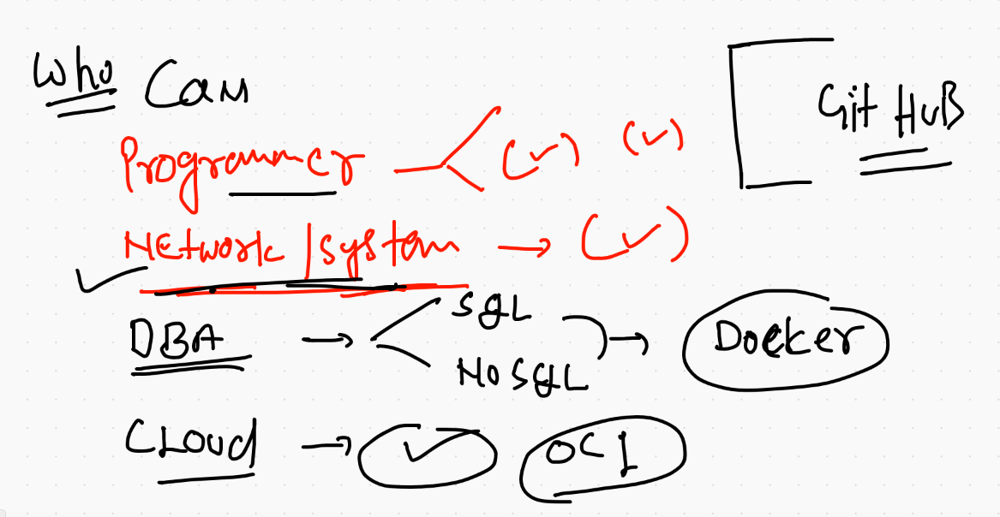

## app deployment in past 

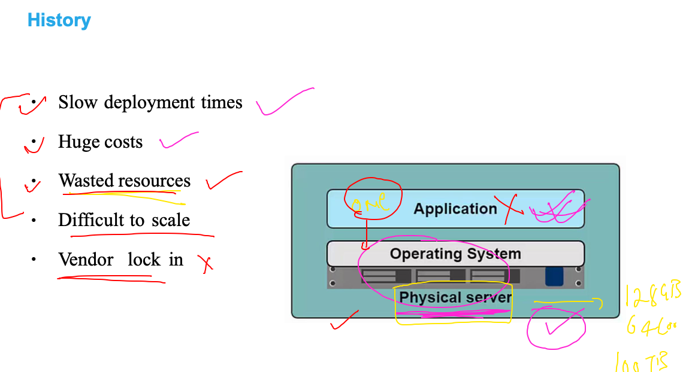

## solution to hardware based deployment is virtualization 

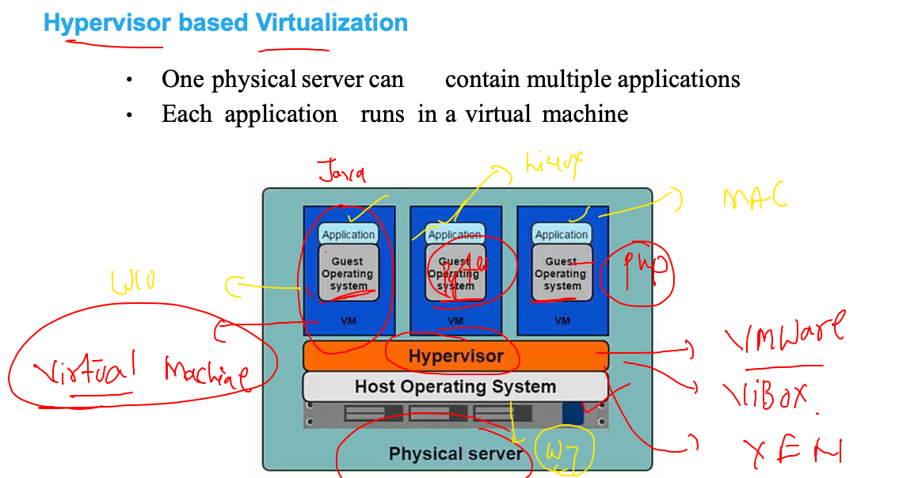

## Introduction to container platforms 

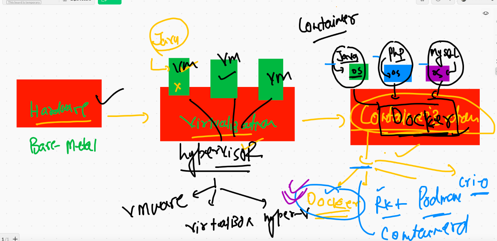

## what is container 

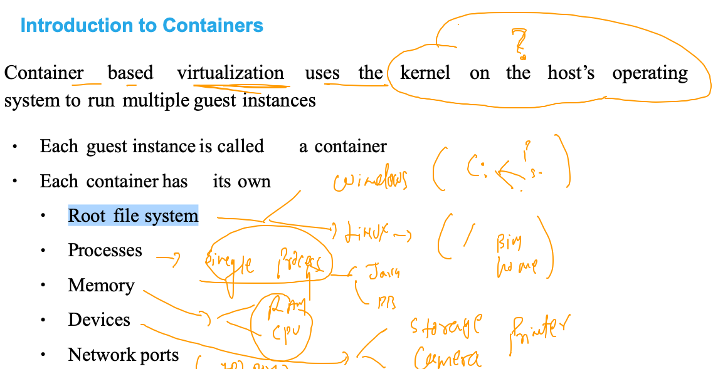

## understand  kernel 

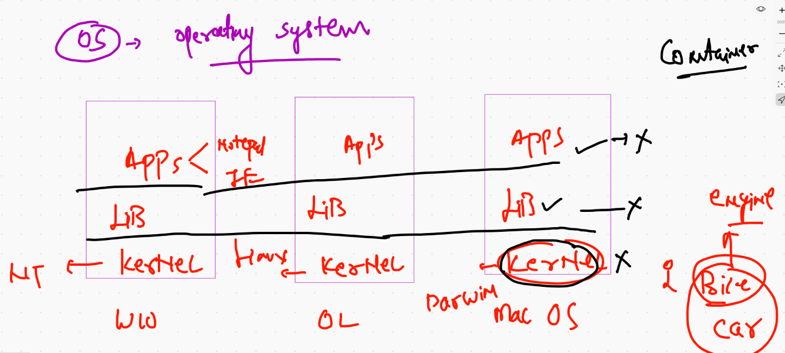

## Docker info 

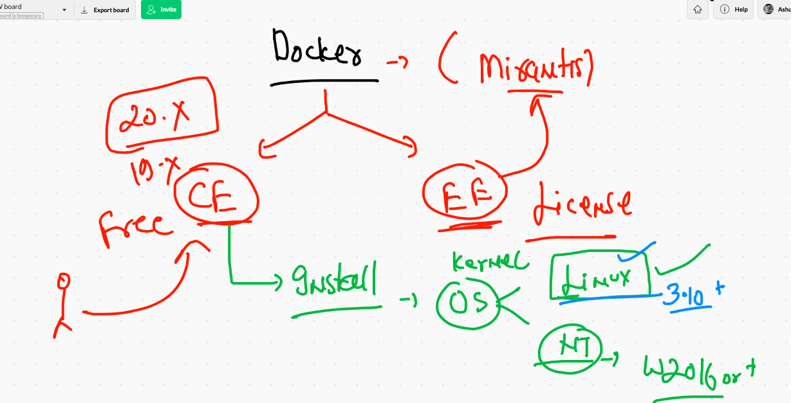

## to download docker desktop for windows 10 

['Docker desktop windows 10'](https://docs.docker.com/docker-for-windows/install/)

## Docker desktop reality 

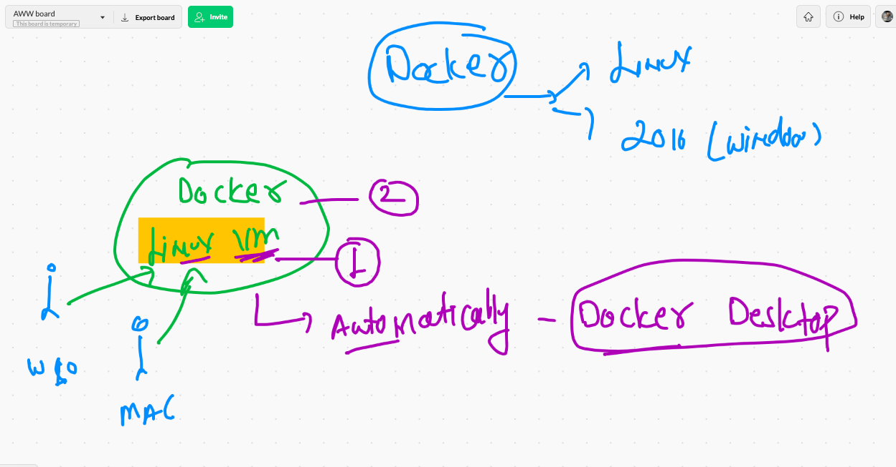


## Docker architecture 

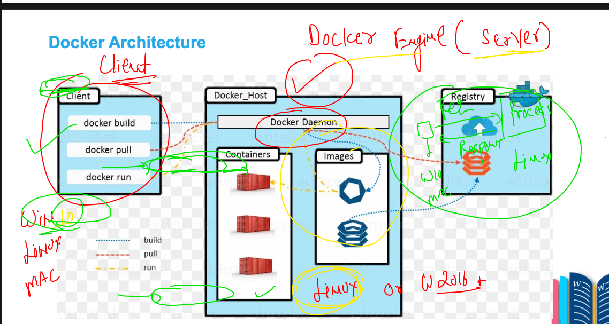


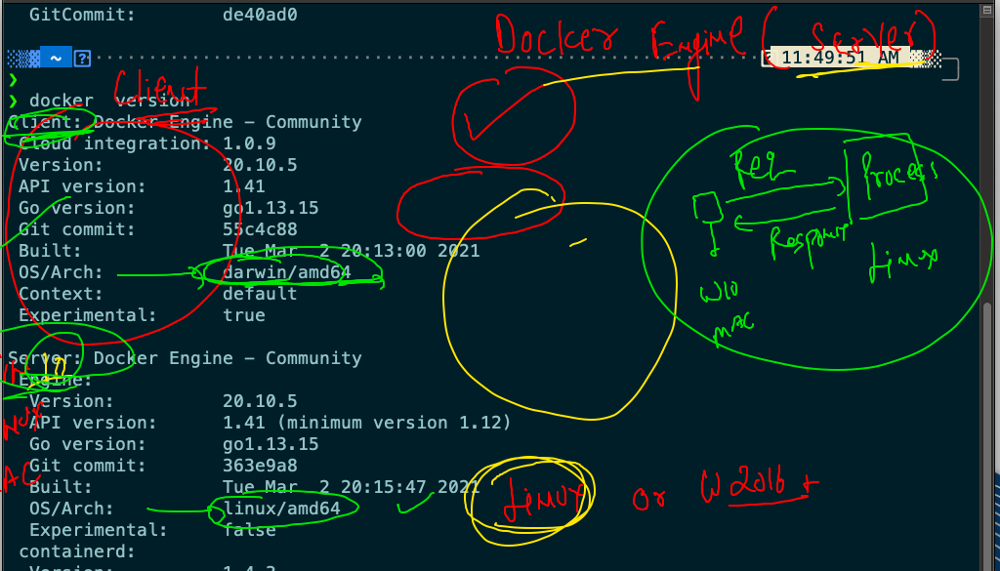

## Intalling docker. in linux based OS 

```
[root@ip-172-31-6-70 ~]# yum   install  docker  -y
Failed to set locale, defaulting to C
Loaded plugins: extras_suggestions, langpacks, priorities, update-motd
amzn2-core                                                                      | 3.7 kB  00:00:00     
Resolving Dependencies
--> Running transaction check
---> Package docker.x86_64 0:20.10.4-1.amzn2 will be installed
--> Processing Dependency: runc >= 1.0.0 for package: docker-20.10.4-1.amzn2.x86_64
--> Processing Dependency: libcgroup >= 0.40.rc1-5.15 for package: docker-20.10.4-1.amzn2.x86_64
--> Processing Dependency: containerd >= 1.3.2 for package: docker-20.10.4-1.amzn2.x86_64
--> Processing Dependency: pigz for package: docker-20.10.4-1.amzn2.x86_64
--> Running transaction check
---> Package containerd.x86_64 0:1.4.4-1.amzn2 will be installed
---> Package libcgroup.x86_64 0:0.41-21.amzn2 will be installed
---> Package pigz.x86_64 0:2.3.4-1.amzn2.0.1 will be installed
---> Package runc.x86_64 0:1.0.0-0.1.20210225.git12644e6.amzn2 will be installed
--> Finished Dependency Resolution

Dependencies Resolved

```


## starting docker engine 

```
[root@ip-172-31-6-70 ~]# systemctl start  docker 
[root@ip-172-31-6-70 ~]# systemctl enable  docker 
Created symlink from /etc/systemd/system/multi-user.target.wants/docker.service to /usr/lib/systemd/system/docker.service.
[root@ip-172-31-6-70 ~]# systemctl status  docker 
● docker.service - Docker Application Container Engine
   Loaded: loaded (/usr/lib/systemd/system/docker.service; enabled; vendor preset: disabled)
   Active: active (running) since Mon 2021-05-03 06:34:03 UTC; 15s ago
     Docs: https://docs.docker.com
 Main PID: 3949 (dockerd)
   CGroup: /system.slice/docker.service
           └─3949 /usr/bin/dockerd -H fd:// --containerd=/run/containerd/containerd.sock --default-u...

May 03 06:34:03 ip-172-31-6-70.ec2.internal dockerd[3949]: time="2021-05-03T06:34:03.047333813Z" l...pc
May 03 06:34:03 ip-172-31-6-70.ec2.internal dockerd[3949]: time="2021-05-03T06:34:03.047352803Z" l...pc
May 03 06:34:03 ip-172-3

```

## configure docker engine to accept remote connection 

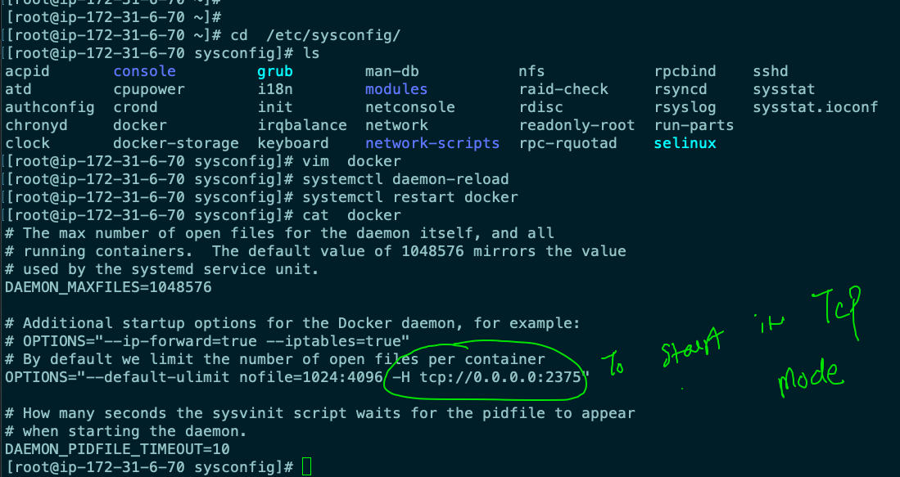

## Docker client options 

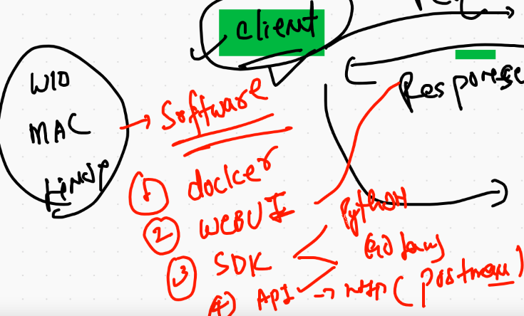

## Using docker cli to send request 

### check docker engine connection 

```
❯ docker  context   ls
NAME                TYPE                DESCRIPTION                               DOCKER ENDPOINT               KUBERNETES ENDPOINT                    ORCHESTRATOR
default *           moby                Current DOCKER_HOST based configuration   unix:///var/run/docker.sock   https://54.227.223.108:6443 (ashuns)   swarm


```

### creating context 

```
❯ docker  context  create  ashuDE   --docker  "host=tcp://54.235.252.191:2375"
ashuDE
Successfully created context "ashuDE"
❯ docker  context   ls
NAME                TYPE                DESCRIPTION                               DOCKER ENDPOINT               KUBERNETES ENDPOINT                    ORCHESTRATOR
ashuDE              moby                                                          tcp://54.235.252.191:2375                                            
default *           moby                Current DOCKER_HOST based configuration   unix:///var/run/docker.sock   https://54.227.223.108:6443 (ashuns)   swarm

```

### change / switch context 

```
❯ docker  context   use  ashuDE
ashuDE
❯ docker  context   ls
NAME                TYPE                DESCRIPTION                               DOCKER ENDPOINT               KUBERNETES ENDPOINT                    ORCHESTRATOR
ashuDE *            moby                                                          tcp://54.235.252.191:2375                                            
default             moby                Current DOCKER_HOST based configuration   unix:///var/run/docker.sock   https://54.227.223.108:6443 (ashuns)   swarm


```

## Docker summary 

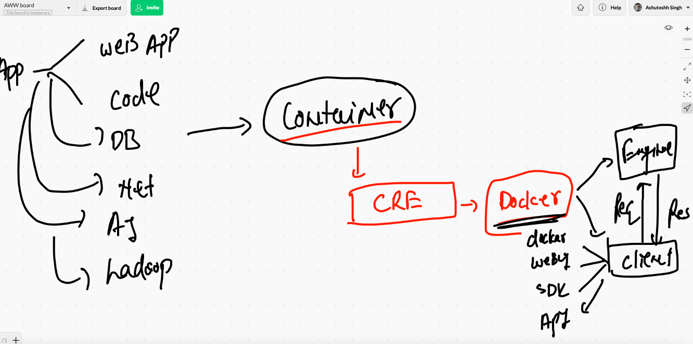

## Containerization process steps

### need to create docker images 

### from those docker images we need to create containers

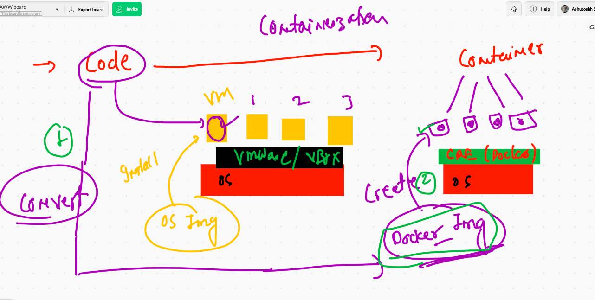

## TO download docker images we can use Docker HUb as registry 


## Docker client side operations 

### searching image on docker hub 

```
0029  docker  search   java
10030  docker  search   mysql
10031  docker  search   oraclelinux
❯ docker  search   ashutoshh
NAME                           DESCRIPTION   STARS     OFFICIAL   AUTOMATED
ashutoshh/cent6ssh_http                      1                    
ashutoshh/centos6ssh                         0                    
ashutoshh/24dec2014                          0                    
ashutoshh/apache2.4                          0                    
ashutoshh/yureka                             0                    
ashutoshh/centos7systemd                     0                    
dockerashu/ashutoshheyfebapp                 0                    
ashutoshh/dd2527ea18bd                       0                    
ashutoshh/ocphp                              0                    
dockerashu/ashutoshh                         0                    
❯ docker  search  dockerashu
NAME                           DESCRIPTION   STARS     OFFICIAL   AUTOMATED
dockerashu/oracleweb                         0                    
dockerashu/nginx                             0                    
dockerashu/microsoftapp                      0                    
dockerashu/ckad                  

```
## Downloading docker images into docker engine machine from docker hub 

```
❯ docker  images
REPOSITORY   TAG       IMAGE ID       CREATED       SIZE
openjdk      latest    9991202d6ad6   12 days ago   467MB
alpine       latest    6dbb9cc54074   2 weeks ago   5.61MB
❯ docker  pull  oraclelinux:8.3
8.3: Pulling from library/oraclelinux
dd34f38d274c: Pull complete 
Digest: sha256:af3182ee6c1e56f18fc1fecaf638da57d7c47233862e5c32f5ad723a6ab4c6db
Status: Downloaded newer image for oraclelinux:8.3
docker.io/library/oraclelinux:8.3
❯ docker images
REPOSITORY    TAG       IMAGE ID       CREATED       SIZE
openjdk       latest    9991202d6ad6   12 days ago   467MB
oraclelinux   8.3       816d99f0bbe8   2 weeks ago   224MB
alpine        latest    6dbb9cc54074   2 weeks ago   5.61MB

```

## docker engine store all data in a directory 

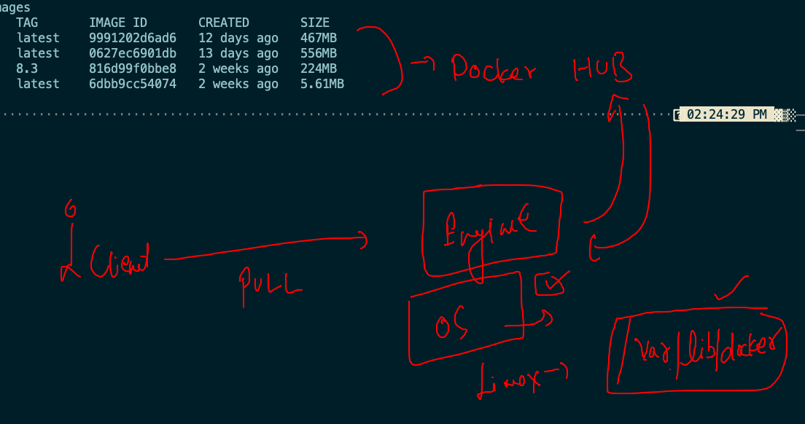

## ON docker engine server side image stores at 

```
[root@ip-172-31-6-70 ~]# cd /var/lib/docker/
[root@ip-172-31-6-70 docker]# ls
buildkit  containers  image

```

## importance of process (parent process) in container 

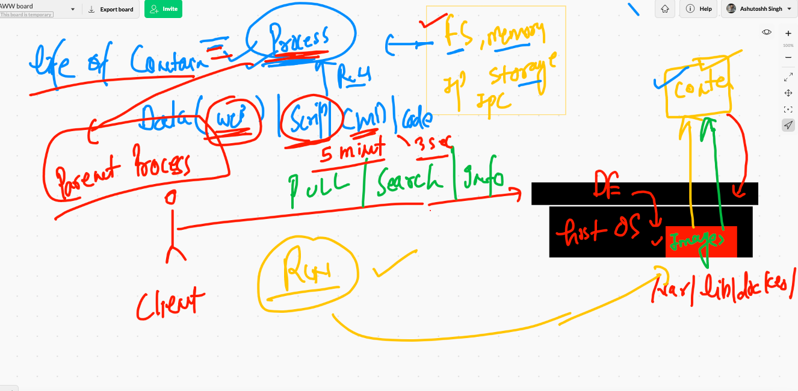

## creating first container 

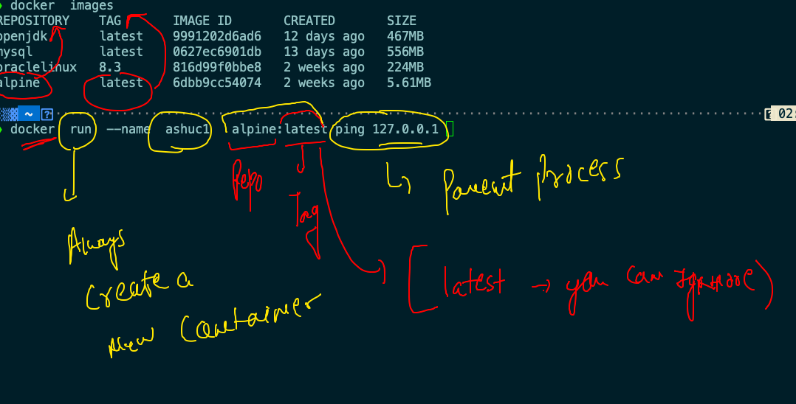

## list of running containers

```
❯ docker  ps
CONTAINER ID   IMAGE           COMMAND            CREATED              STATUS              PORTS     NAMES
941cdb3153a6   alpine:latest   "ping 127.0.0.1"   About a minute ago   Up About a minute             Engine2
3ba77a21e3bd   alpine:latest   "ping 127.0.0.1"   About a minute ago   Up About a minute             ramanc1
6b9dedd79882   alpine:latest   "ping 127.0.0.1"   About a minute ago   Up About a minute             ashuc1

```

## best practise to create container 

```
❯ docker  run -itd  --name  ashuc4  alpine
0ba4af4979f13e7585dcc8911f5ee84cdcc7aed3522aa6e40117fa724286feff
❯ docker  ps
CONTAINER ID   IMAGE           COMMAND            CREATED              STATUS              PORTS     NAMES
0ba4af4979f1   alpine          "/bin/sh"          8 seconds ago        Up 3 seconds                  ashuc4
b26c41f2d100   alpine:latest   "ping 127.0.0.1"   About a minute ago   Up About a minute             hello
b0c808c5c846   alpine:latest   "ping 127.0.0.1"   3 minutes ago        Up 3 minutes                  Testc1
4379d5041e2f   alpine          "ping 127.0.0.1"   4 minutes ago        Up 4 minutes                  namanc1
19f9fe3a2715   alpine:latest   "ping 127.0.0.1"   6 minutes ago        Up 6 minutes                  frosty_matsumoto
f36e636c0a74   alpine:latest   "ping 127.0.0.1"   6 minutes ago        Up 6 minutes                  helloc2
63bb528cf111   alpine:latest   "ping 127.0.0.1"   8 minutes ago        Up 8 minutes                  richik1
667658220f94   alpine          "ping 127.0.0.1"   8 minutes ago        Up 8 minutes                  hellodocker
❯ docker  run -itd  --name  ashuc5  alpine  ping google.com
601f71605b5b8235dc79a8862e238cdf9085c17e869c061b1056bf6ac6103153
❯ docker  ps
CONTAINER ID   IMAGE           COMMAND             CREATED          STATUS          PORTS     NAMES
601f71605b5b   alpine          "ping google.com"   7 seconds ago    Up 3 seconds              ashuc5
0ba4af4979f1   alpine          "/bin/sh"           42 seconds ago   Up 37 seconds             ashuc4

```

## checking output of a running container process

```
 docker  logs  ashuc5 
 
```

### live output 

```
 docker  logs  -f ashuc5
```


### stop a running container 

```
docker  stop   ashuc5
```

### starting a stopped container 

```
 docker  start  ashuc5
```

### tip to remove all non running containers 

```
❯ docker  rm   $(docker  ps -aq)
ad0267de41e5
7b09192ba6b7
0587817d3bed
40ec94f6a304
65e995ade751
1d8f3ecd8ddb
b40bb9cad879
001c8cf61038
53699470e90d
1a7667b4a8c9
153dfca1b50e
a6232a81b77b
679732f74e28
06136787e37b

```


