# Docker revision 

## Certification tracks in containerization world 


## Docker component one more time 

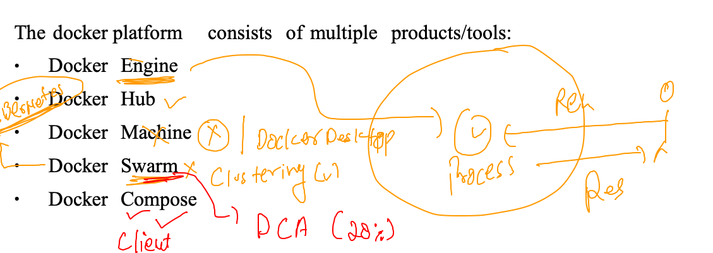

## Docker volumes 

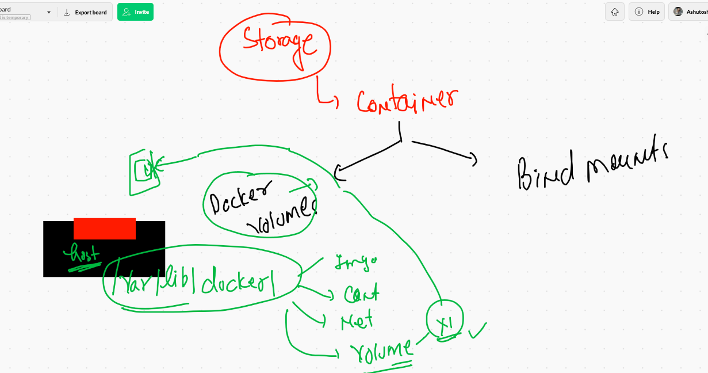

### clean up docker engine data 

```
10010  docker  rm $(docker ps -aq) -f
10011  docker  rmi $(docker images -q) -f
10012  history
10013  docker network ls
10014  docker  network prune 
10015  docker network ls
❯ docker  images ;  docker  ps -a ; docker network ls
REPOSITORY   TAG       IMAGE ID   CREATED   SIZE
CONTAINER ID   IMAGE     COMMAND   CREATED   STATUS    PORTS     NAMES
NETWORK ID     NAME      DRIVER    SCOPE
ba151bd62c3e   bridge    bridge    local
87e51b407d02   host      host      local
ec2c48f04c56   none      null      local
```

## VOlume by docker 

### creating volume 

```
❯ docker  volume   create   ashuvol1
ashuvol1
❯ docker  volume  ls
DRIVER    VOLUME NAME
local     8f7748e6b618428df405156774a54e86f3dacd4ab3bea89db4340714db59b7e6
local     00968884402c057daecce3b142be348f51c95bf12fd97101a5cae1d8a6d339cb
local     ashuvol1

```

### creating container with docker volume 

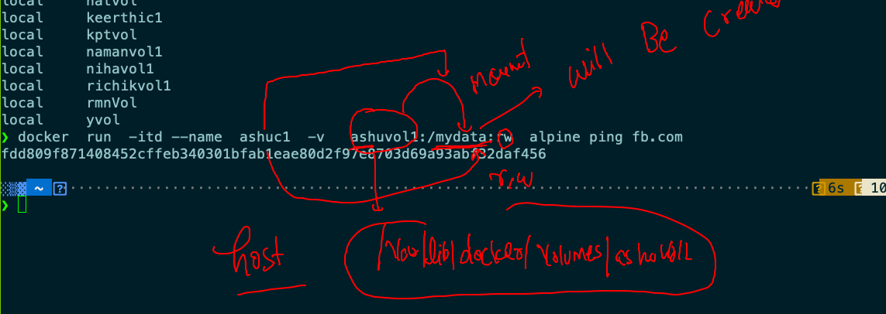

### checking mount 

```
❯ docker  exec -it  ashuc1 sh
/ # ls
bin     etc     lib     mnt     opt     root    sbin    sys     usr
dev     home    media   mydata  proc    run     srv     tmp     var
/ # cd  mydata/
/mydata # ls
/mydata # mkdir  a b c d
/mydata # ls
a  b  c  d
/mydata # echo hello   >a.txt
/mydata # ls
a      a.txt  b      c      d
/mydata # exit

```

### mounting above volume into another container 

```
❯ docker  run -ti --rm  -v  ashuvol1:/new:ro   oraclelinux:8.3  bash
Unable to find image 'oraclelinux:8.3' locally
8.3: Pulling from library/oraclelinux
dd34f38d274c: Pull complete 
Digest: sha256:af3182ee6c1e56f18fc1fecaf638da57d7c47233862e5c32f5ad723a6ab4c6db
Status: Downloaded newer image for oraclelinux:8.3
[root@b6ae9fc31969 /]# 
[root@b6ae9fc31969 /]# 
[root@b6ae9fc31969 /]# ls
bin  boot  dev  etc  home  lib  lib64  media  mnt  new  opt  proc  root  run  sbin  srv  sys  tmp  usr  var
[root@b6ae9fc31969 /]# cd  new/
[root@b6ae9fc31969 new]# ls
a  a.txt  b  c  d
[root@b6ae9fc31969 new]# mkdir  hello
mkdir: cannot create directory 'hello': Read-only file system
[root@b6ae9fc31969 new]# rmdir   a
rmdir: failed to remove 'a': Read-only file system

```

## more deep volume concept 

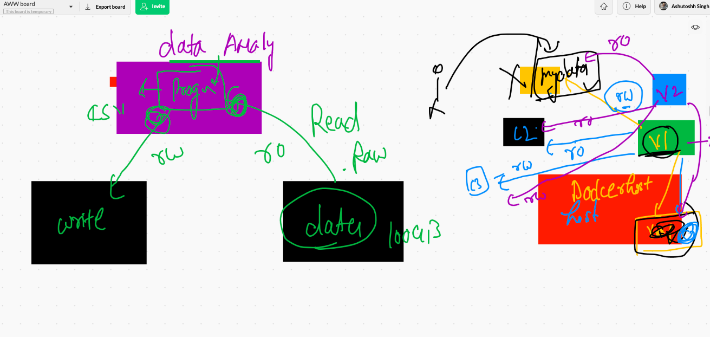

## mounting multiple volume in a single container 

```
 docker  run -itd --name ashuc2  -v  ashuvol1:/hello1:ro   -v  ashuvol2:/hello2:rw  alpine sh
7701b8d5bf78632b4b46917f8c1c8dfae07a24cbaaf91a0a7e0297d3f8856e97

```

## BInd mounts in docker container 

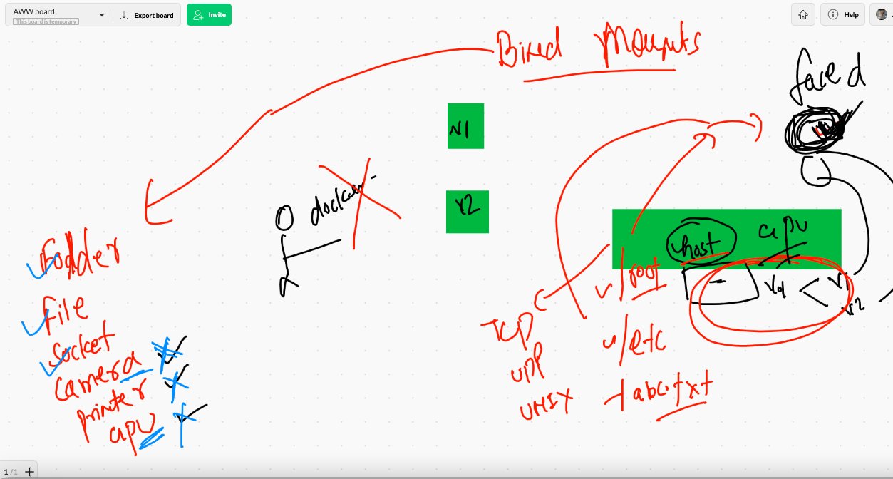

### example 1

```
❯ docker  run -tid --name  ashuc3  -v   /etc:/myetc:ro   alpine sh
f7e390c7b1be9e79f140242702451eb04a097d005070fff7aaba9015a177bd1f

❯ docker  ps
CONTAINER ID   IMAGE     COMMAND   CREATED              STATUS              PORTS     NAMES
f241efb891b0   alpine    "sh"      10 seconds ago       Up 7 seconds                  richik3
f7e390c7b1be   alpine    "sh"      About a minute ago   Up About a minute             ashuc3
❯ docker  exec -it  ashuc3  sh
/ # cd  /myetc/
/myetc # ls
DIR_COLORS               docker                   ld.so.conf.d             pkcs11                   shadow
DIR_COLORS.256color      docker-runtimes.d        libaudit.conf            pki                      shadow-
DIR_COLORS.lightbgcolor  dracut.conf              libnl                    plymouth                 shells
GREP_COLORS              dracut.conf.d            libuser.conf             pm                       skel
GeoIP.conf               e2fsck.

```


### mounting file from host to container 

```
❯ docker  run -tid --name  ashuc4  -v   /etc/hosts:/aa.txt:ro   alpine sh
13c1bf66a9c251cd490c9253bbfcaa0e667af49034b7685d1a9c553f13a8071c
docker  exec -it%                                                                                                              ❯ docker  exec -it  ashuc4 sh
/ # cat  /aa.txt 
127.0.0.1   localhost localhost.localdomain localhost4 localhost4.localdomain4
::1         localhost6 localhost6.localdomain6

```

### final socket example 

```
 docker  run -tid --name webui1  -v  /var/run/docker.sock:/var/run/docker.sock -p 1234:9000  portainer/portainer
Unable to find image 'portainer/portainer:latest' locally
latest: Pulling from portainer/portainer
94cfa856b2b1: Pull complete 
49d59ee0881a: Pull complete 
a2300fd28637: Pull complete 
Digest: sha256:fb45b43738646048a0a0cc74fcee2865b69efde857e710126084ee5de9be0f3f
Status: Downloaded newer image for portainer/portainer:latest
abf8ec94d5a945524bfdd267628ece4a62bf8a66c66ddd50a6746a2207a25983

```

## Best practise to containerize 

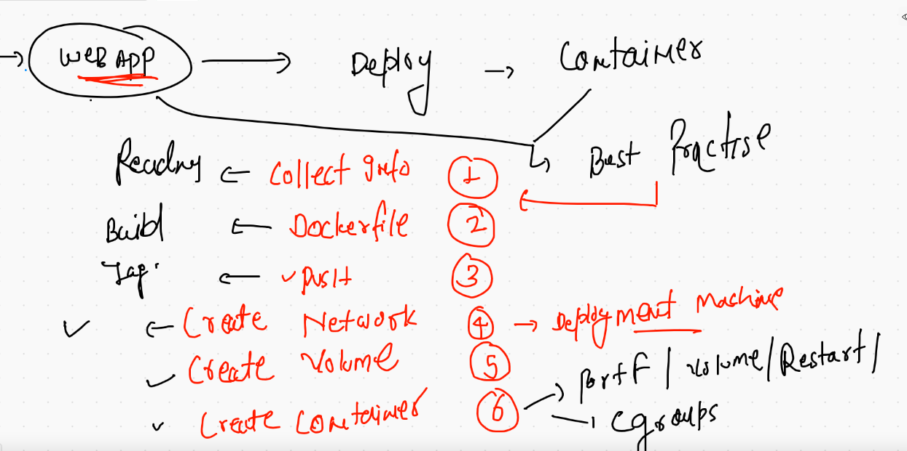

# Docker compose 

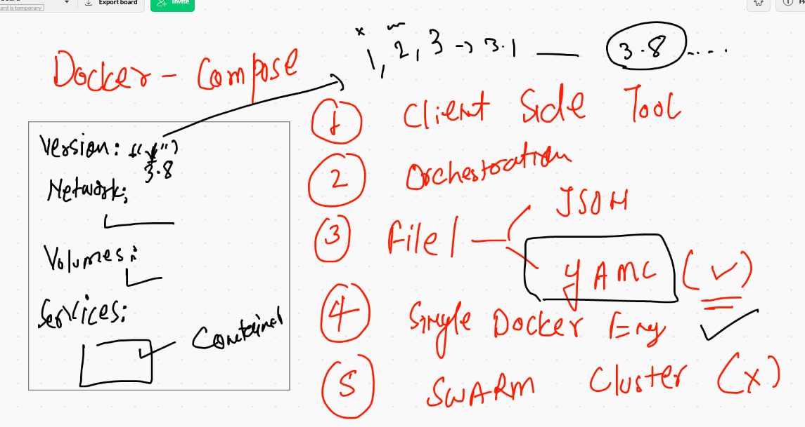


## checking docker compose file version history 

[compose_file_version](https://docs.docker.com/compose/compose-file/)


### sample compose file 

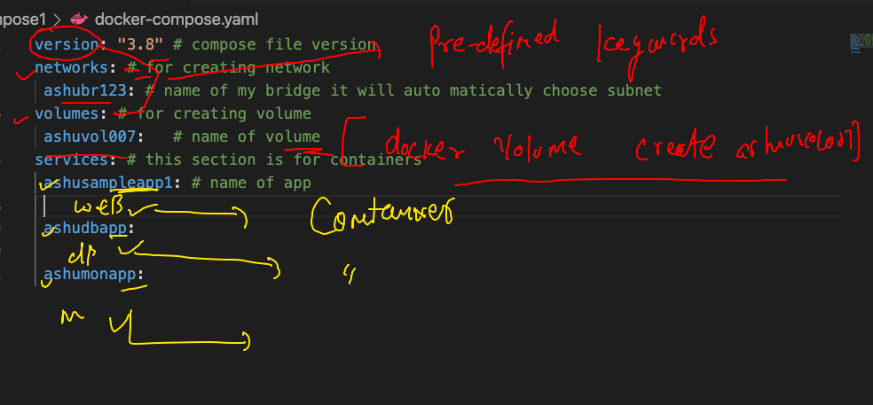

### deploy first compose file 

```
❯ cd  compose1
❯ ls
docker-compose.yaml
❯ docker-compose  up  -d
Creating network "compose1_ashubr123" with the default driver
Creating volume "compose1_ashuvol007" with default driver
Creating ashucxv123 ... done
❯ docker-compose  ps
   Name        Command     State   Ports
----------------------------------------
ashucxv123   ping fb.com   Up           

```

### more commands on compose 

```
10077  docker-compose  up  -d 
10078  docker-compose  ps
10079  docker-compose  logs 
❯ docker-compose  ps
 Name      Command     State   Ports
------------------------------------
anshul   ping fb.com   Up           
❯ docker-compose  kill
Killing anshul ... done
❯ docker-compose  ps
 Name      Command      State     Ports
---------------------------------------
anshul   ping fb.com   Exit 137        
❯ docker-compose  start
Starting ashusampleapp1 ... done
❯ docker-compose  ps
 Name      Command     State   Ports
------------------------------------
anshul   ping fb.com   Up           
❯ docker-compose  down
Stopping anshul ... done
WARNING: Found orphan containers (gopalcxv123, testappcon, namc0) for this project. If you removed or renamed this service in your compose file, you can run this command with the --remove-orphans flag to clean it up.
Removing anshul ... done
Removing network compose1_ashubr123

```

### building and creation contaier

```
❯ cd  webapp
❯ ls
Dockerfile         ashu.html          docker-compose.yml docker.png
❯ docker-compose up  -d
Creating network "webapp_ashubrx999" with the default driver
WARNING: Found orphan containers (nandhawebcon1) for this project. If you removed or renamed this service in your compose file, you can run this command with the --remove-orphans flag to clean it up.
Building ashuwebapp
Sending build context to Docker daemon  67.07kB

Step 1/6 : FROM oraclelinux:8.3
 ---> 816d99f0bbe8
Step 2/6 : MAINTAINER ashutoshh@linux.com
 ---> Using cache
 ---> dae5c4457196
Step 3/6 : RUN dnf install httpd -y
 ---> Running in b60f86b22244
Oracle Linux 8 BaseOS Latest (x86_64)           8.3 MB/s |  32 MB     00:03    


```

### checking more 

```
10092  docker-compose up  -d
10093  docker network  ls
❯ docker-compose ps
  Name                 Command              State          Ports        
------------------------------------------------------------------------
ashucc112   /bin/sh -c httpd -DFOREGROUND   Up      0.0.0.0:8811->80/tcp
❯ docker-compose images
Container   Repository   Tag      Image Id       Size  
-------------------------------------------------------
ashucc112   ashuwebapp   v009   44148ee55369   352.1 MB

```

# Docker Engine is not good for production grade application deployment 

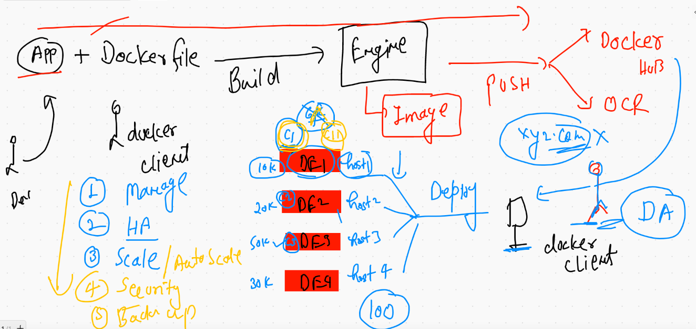

## contrainer orchestration tools / tech 

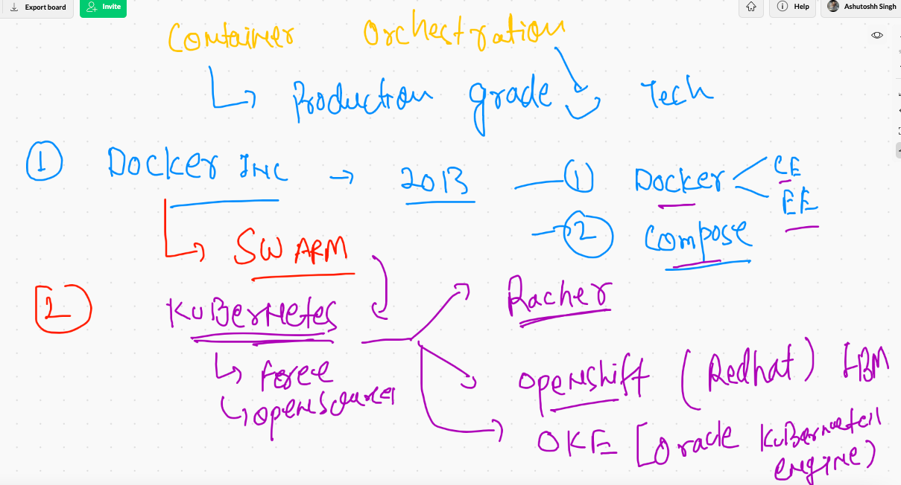

# K8s 

## architecture of k8s 


## kube-apiserver 

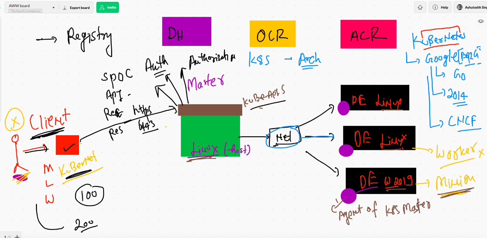

## kube-schedular 

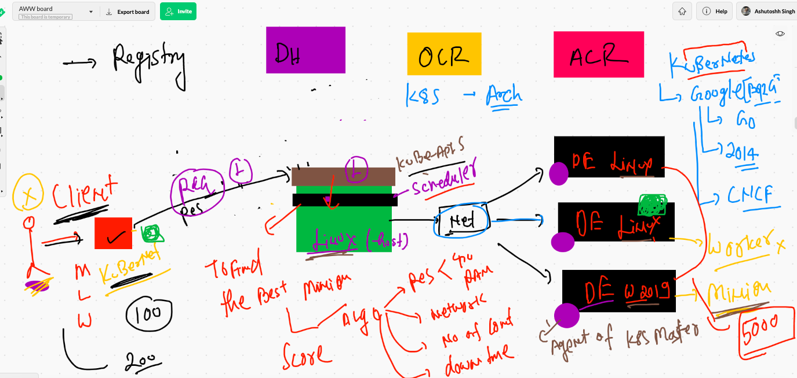

##  few info about kube-controller-manager

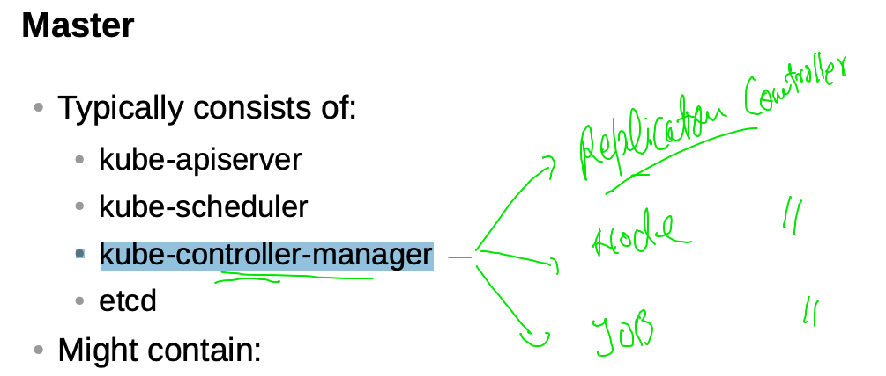


## replication controller 

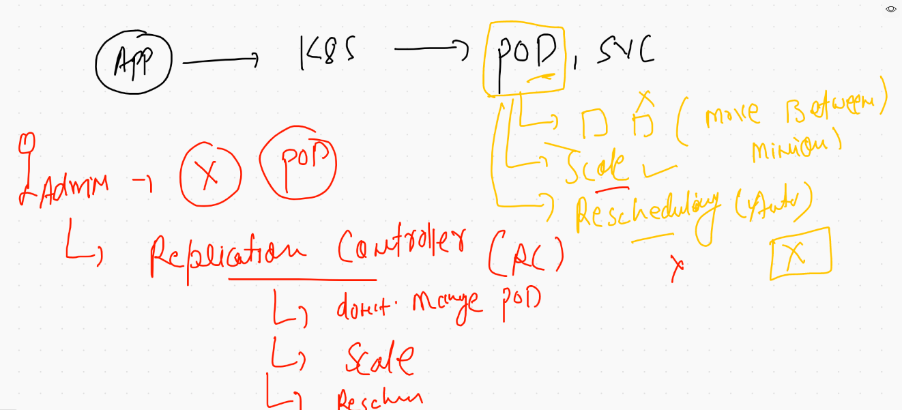

## Node controller 

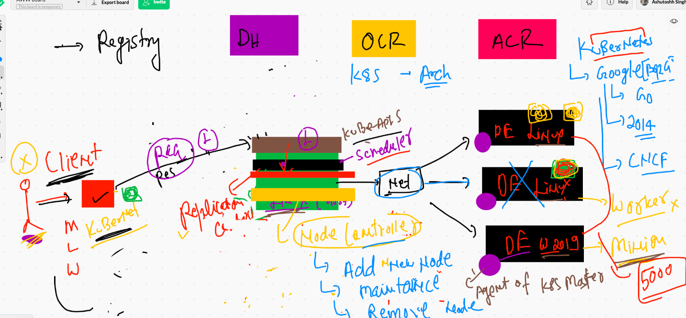

## ETCD 

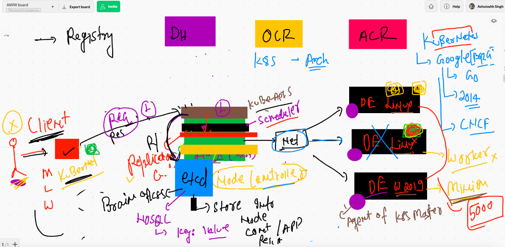


# MInion nodes 

## container networking options 

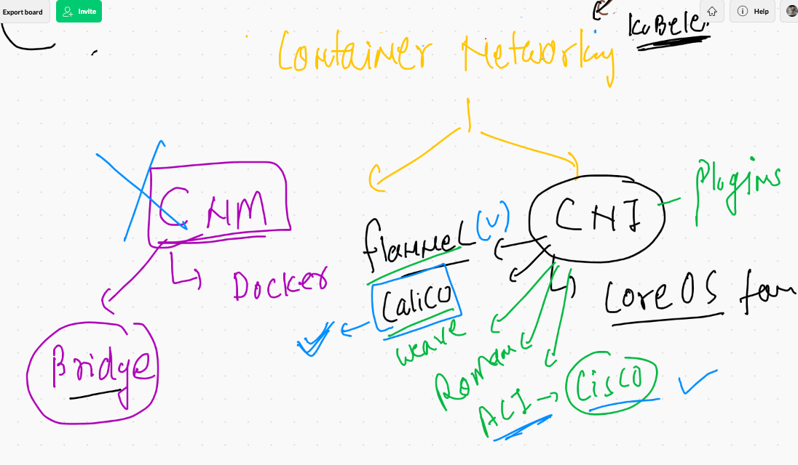

## minion in one shot 

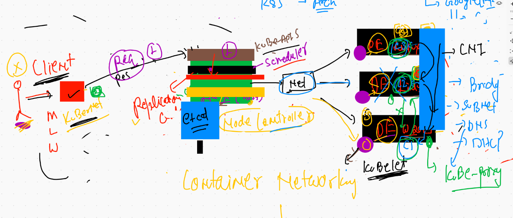

## final k8s architecture overview 


# k8s cluster deployment options 

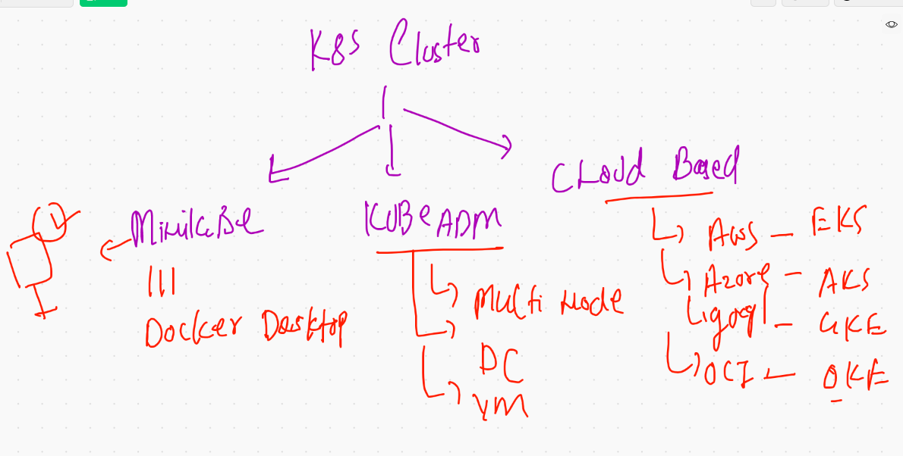

## just installing minikube software  {MInikube is just an installer of k8s cluster in your pc/laptop}

```
❯ curl -LO https://storage.googleapis.com/minikube/releases/latest/minikube-darwin-amd64
  % Total    % Received % Xferd  Average Speed   Time    Time     Time  Current
                                 Dload  Upload   Total   Spent    Left  Speed
100 59.6M  100 59.6M    0     0  2998k      0  0:00:20  0:00:20 --:--:-- 2552k
❯ sudo install minikube-darwin-amd64 /usr/local/bin/minikube
Password:
❯ minikube version
minikube version: v1.19.0
commit: 15cede53bdc5fe242228853e737333b09d4336b5

```


### checking connection from client to master 

```
❯ kubectl   cluster-info   --kubeconfig admin.conf
Kubernetes control plane is running at https://54.243.78.205:6443
CoreDNS is running at https://54.243.78.205:6443/api/v1/namespaces/kube-system/services/kube-dns:dns/proxy

To further debug and diagnose cluster problems, use 'kubectl cluster-info dump'.
❯ kubectl   version    --kubeconfig admin.conf
Client Version: version.Info{Major:"1", Minor:"21", GitVersion:"v1.21.0", GitCommit:"cb303e613a121a29364f75cc67d3d580833a7479", GitTreeState:"clean", BuildDate:"2021-04-08T16:31:21Z", GoVersion:"go1.16.1", Compiler:"gc", Platform:"darwin/amd64"}
Server Version: version.Info{Major:"1", Minor:"21", GitVersion:"v1.21.0", GitCommit:"cb303e613a121a29364f75cc67d3d580833a7479", GitTreeState:"clean", BuildDate:"2021-04-08T16:25:06Z", GoVersion:"go1.16.1", Compiler:"gc", Platform:"linux/amd64"}
❯ kubectl   get  nodes   --kubeconfig admin.conf
NAME                            STATUS   ROLES                  AGE     VERSION
ip-172-31-72-151.ec2.internal   Ready    <none>                 7h39m   v1.21.0
k8s-master                      Ready    control-plane,master   7h41m   v1.21.0
k8s-minion2                     Ready    <none>                 7h39m   v1.21.0

```

## understanding application deployment 

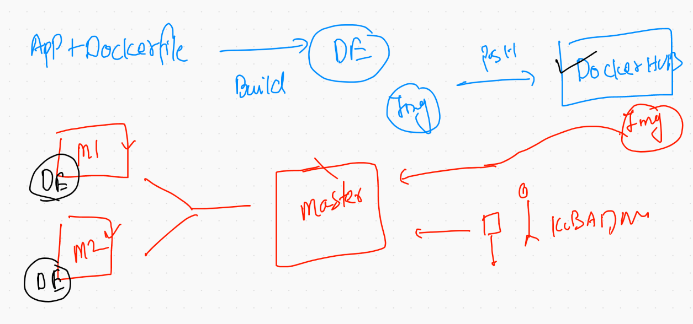

## understanding journey from container to pod


## understanding pod design using docker compose 

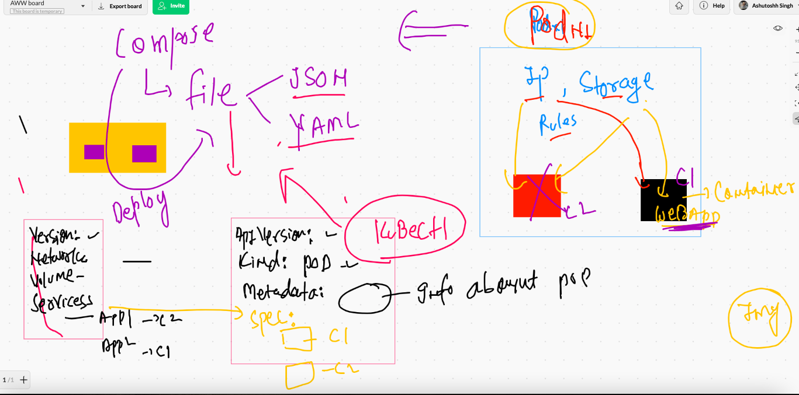

### Deployment of first pod 

```
❯ ls
ashupod1.yaml
❯ kubectl  apply  -f  ashupod1.yaml
pod/ashupod-1 created
❯ kubectl   get   pods
NAME          READY   STATUS              RESTARTS   AGE
amanpod-1     0/1     ContainerCreating   0          2s
ashupod-1     1/1     Running             0          10s
nandhapod-1   1/1     Running             0          3s
❯ kubectl   get   pods
NAME          READY   STATUS    RESTARTS   AGE
amanpod-1     1/1     Running   0          20s
ashupod-1     1/1     Running   0          28s
nandhapod-1   1/1     Running   0          21s
ypod-1        1/1     Running   0          8s

```

