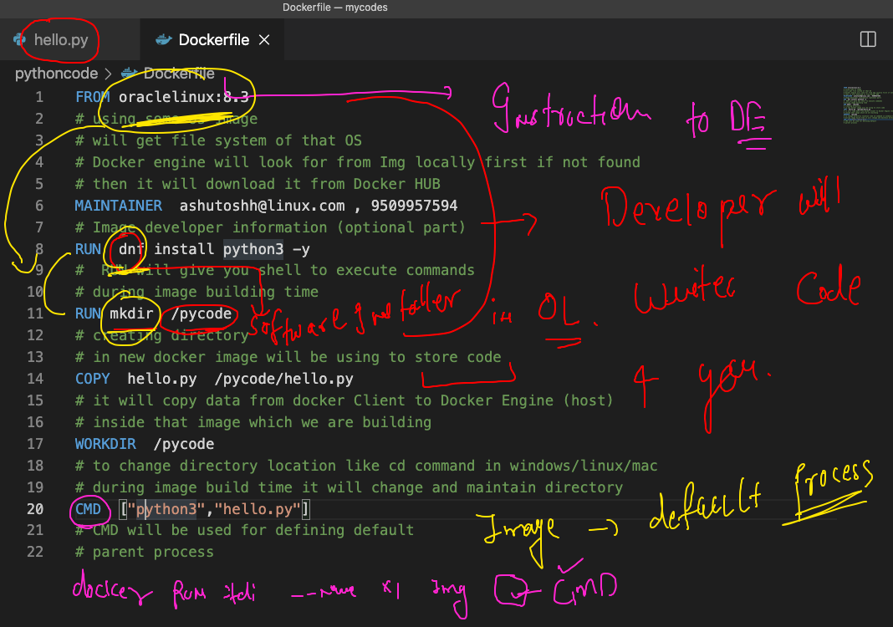

# who can attend 


## app deployment in past 


## solution to hardware based deployment is virtualization 


## Introduction to container platforms 


## what is container 


## understand  kernel 


## Docker info 


## to download docker desktop for windows 10 

['Docker desktop windows 10'](https://docs.docker.com/docker-for-windows/install/)

## Docker desktop reality 


## Docker architecture 


## Intalling docker. in linux based OS 

```
[root@ip-172-31-6-70 ~]# yum   install  docker  -y
Failed to set locale, defaulting to C
Loaded plugins: extras_suggestions, langpacks, priorities, update-motd
amzn2-core                                                                      | 3.7 kB  00:00:00     
Resolving Dependencies
--> Running transaction check
---> Package docker.x86_64 0:20.10.4-1.amzn2 will be installed
--> Processing Dependency: runc >= 1.0.0 for package: docker-20.10.4-1.amzn2.x86_64
--> Processing Dependency: libcgroup >= 0.40.rc1-5.15 for package: docker-20.10.4-1.amzn2.x86_64
--> Processing Dependency: containerd >= 1.3.2 for package: docker-20.10.4-1.amzn2.x86_64
--> Processing Dependency: pigz for package: docker-20.10.4-1.amzn2.x86_64
--> Running transaction check
---> Package containerd.x86_64 0:1.4.4-1.amzn2 will be installed
---> Package libcgroup.x86_64 0:0.41-21.amzn2 will be installed
---> Package pigz.x86_64 0:2.3.4-1.amzn2.0.1 will be installed
---> Package runc.x86_64 0:1.0.0-0.1.20210225.git12644e6.amzn2 will be installed
--> Finished Dependency Resolution

Dependencies Resolved

```


## starting docker engine 

```
[root@ip-172-31-6-70 ~]# systemctl start  docker 
[root@ip-172-31-6-70 ~]# systemctl enable  docker 
Created symlink from /etc/systemd/system/multi-user.target.wants/docker.service to /usr/lib/systemd/system/docker.service.
[root@ip-172-31-6-70 ~]# systemctl status  docker 
● docker.service - Docker Application Container Engine
   Loaded: loaded (/usr/lib/systemd/system/docker.service; enabled; vendor preset: disabled)
   Active: active (running) since Mon 2021-05-03 06:34:03 UTC; 15s ago
     Docs: https://docs.docker.com
 Main PID: 3949 (dockerd)
   CGroup: /system.slice/docker.service
           └─3949 /usr/bin/dockerd -H fd:// --containerd=/run/containerd/containerd.sock --default-u...

May 03 06:34:03 ip-172-31-6-70.ec2.internal dockerd[3949]: time="2021-05-03T06:34:03.047333813Z" l...pc
May 03 06:34:03 ip-172-31-6-70.ec2.internal dockerd[3949]: time="2021-05-03T06:34:03.047352803Z" l...pc
May 03 06:34:03 ip-172-3

```

## configure docker engine to accept remote connection 


## Docker client options 


## Using docker cli to send request 

### check docker engine connection 

```
❯ docker  context   ls
NAME                TYPE                DESCRIPTION                               DOCKER ENDPOINT               KUBERNETES ENDPOINT                    ORCHESTRATOR
default *           moby                Current DOCKER_HOST based configuration   unix:///var/run/docker.sock   https://54.227.223.108:6443 (ashuns)   swarm


```

### creating context 

```
❯ docker  context  create  ashuDE   --docker  "host=tcp://54.235.252.191:2375"
ashuDE
Successfully created context "ashuDE"
❯ docker  context   ls
NAME                TYPE                DESCRIPTION                               DOCKER ENDPOINT               KUBERNETES ENDPOINT                    ORCHESTRATOR
ashuDE              moby                                                          tcp://54.235.252.191:2375                                            
default *           moby                Current DOCKER_HOST based configuration   unix:///var/run/docker.sock   https://54.227.223.108:6443 (ashuns)   swarm

```

### change / switch context 

```
❯ docker  context   use  ashuDE
ashuDE
❯ docker  context   ls
NAME                TYPE                DESCRIPTION                               DOCKER ENDPOINT               KUBERNETES ENDPOINT                    ORCHESTRATOR
ashuDE *            moby                                                          tcp://54.235.252.191:2375                                            
default             moby                Current DOCKER_HOST based configuration   unix:///var/run/docker.sock   https://54.227.223.108:6443 (ashuns)   swarm


```

## Docker summary 


## Containerization process steps

### need to create docker images 

### from those docker images we need to create containers


## TO download docker images we can use Docker HUb as registry 


## Docker client side operations 

### searching image on docker hub 

```
0029  docker  search   java
10030  docker  search   mysql
10031  docker  search   oraclelinux
❯ docker  search   ashutoshh
NAME                           DESCRIPTION   STARS     OFFICIAL   AUTOMATED
ashutoshh/cent6ssh_http                      1                    
ashutoshh/centos6ssh                         0                    
ashutoshh/24dec2014                          0                    
ashutoshh/apache2.4                          0                    
ashutoshh/yureka                             0                    
ashutoshh/centos7systemd                     0                    
dockerashu/ashutoshheyfebapp                 0                    
ashutoshh/dd2527ea18bd                       0                    
ashutoshh/ocphp                              0                    
dockerashu/ashutoshh                         0                    
❯ docker  search  dockerashu
NAME                           DESCRIPTION   STARS     OFFICIAL   AUTOMATED
dockerashu/oracleweb                         0                    
dockerashu/nginx                             0                    
dockerashu/microsoftapp                      0                    
dockerashu/ckad                  

```
## Downloading docker images into docker engine machine from docker hub 

```
❯ docker  images
REPOSITORY   TAG       IMAGE ID       CREATED       SIZE
openjdk      latest    9991202d6ad6   12 days ago   467MB
alpine       latest    6dbb9cc54074   2 weeks ago   5.61MB
❯ docker  pull  oraclelinux:8.3
8.3: Pulling from library/oraclelinux
dd34f38d274c: Pull complete 
Digest: sha256:af3182ee6c1e56f18fc1fecaf638da57d7c47233862e5c32f5ad723a6ab4c6db
Status: Downloaded newer image for oraclelinux:8.3
docker.io/library/oraclelinux:8.3
❯ docker images
REPOSITORY    TAG       IMAGE ID       CREATED       SIZE
openjdk       latest    9991202d6ad6   12 days ago   467MB
oraclelinux   8.3       816d99f0bbe8   2 weeks ago   224MB
alpine        latest    6dbb9cc54074   2 weeks ago   5.61MB

```

## docker engine store all data in a directory 


## ON docker engine server side image stores at 

```
[root@ip-172-31-6-70 ~]# cd /var/lib/docker/
[root@ip-172-31-6-70 docker]# ls
buildkit  containers  image

```

## importance of process (parent process) in container 


## creating first container 


## list of running containers

```
❯ docker  ps
CONTAINER ID   IMAGE           COMMAND            CREATED              STATUS              PORTS     NAMES
941cdb3153a6   alpine:latest   "ping 127.0.0.1"   About a minute ago   Up About a minute             Engine2
3ba77a21e3bd   alpine:latest   "ping 127.0.0.1"   About a minute ago   Up About a minute             ramanc1
6b9dedd79882   alpine:latest   "ping 127.0.0.1"   About a minute ago   Up About a minute             ashuc1

```

## best practise to create container 

```
❯ docker  run -itd  --name  ashuc4  alpine
0ba4af4979f13e7585dcc8911f5ee84cdcc7aed3522aa6e40117fa724286feff
❯ docker  ps
CONTAINER ID   IMAGE           COMMAND            CREATED              STATUS              PORTS     NAMES
0ba4af4979f1   alpine          "/bin/sh"          8 seconds ago        Up 3 seconds                  ashuc4
b26c41f2d100   alpine:latest   "ping 127.0.0.1"   About a minute ago   Up About a minute             hello
b0c808c5c846   alpine:latest   "ping 127.0.0.1"   3 minutes ago        Up 3 minutes                  Testc1
4379d5041e2f   alpine          "ping 127.0.0.1"   4 minutes ago        Up 4 minutes                  namanc1
19f9fe3a2715   alpine:latest   "ping 127.0.0.1"   6 minutes ago        Up 6 minutes                  frosty_matsumoto
f36e636c0a74   alpine:latest   "ping 127.0.0.1"   6 minutes ago        Up 6 minutes                  helloc2
63bb528cf111   alpine:latest   "ping 127.0.0.1"   8 minutes ago        Up 8 minutes                  richik1
667658220f94   alpine          "ping 127.0.0.1"   8 minutes ago        Up 8 minutes                  hellodocker
❯ docker  run -itd  --name  ashuc5  alpine  ping google.com
601f71605b5b8235dc79a8862e238cdf9085c17e869c061b1056bf6ac6103153
❯ docker  ps
CONTAINER ID   IMAGE           COMMAND             CREATED          STATUS          PORTS     NAMES
601f71605b5b   alpine          "ping google.com"   7 seconds ago    Up 3 seconds              ashuc5
0ba4af4979f1   alpine          "/bin/sh"           42 seconds ago   Up 37 seconds             ashuc4

```

## checking output of a running container process

```
 docker  logs  ashuc5 
 
```

### live output 

```
 docker  logs  -f ashuc5
```


### stop a running container 

```
docker  stop   ashuc5
```

### starting a stopped container 

```
 docker  start  ashuc5
```

### tip to remove all non running containers 

```
❯ docker  rm   $(docker  ps -aq)
ad0267de41e5
7b09192ba6b7
0587817d3bed
40ec94f6a304
65e995ade751
1d8f3ecd8ddb
b40bb9cad879
001c8cf61038
53699470e90d
1a7667b4a8c9
153dfca1b50e
a6232a81b77b
679732f74e28
06136787e37b

```


### login into container as child process

```
❯ docker run -itd  --name x1  alpine ping  google.com
66a16850d2f8c866cd1de029feddfb0116628e99b1668a2c6968d9cc60e278b0
❯ docker  ps
CONTAINER ID   IMAGE     COMMAND             CREATED         STATUS         PORTS     NAMES
66a16850d2f8   alpine    "ping google.com"   9 seconds ago   Up 3 seconds             x1
❯ 
❯ 
❯ docker  exec  x1   date
Mon May  3 09:53:01 UTC 2021
❯ docker  exec  x1   cal
      May 2021
Su Mo Tu We Th Fr Sa
                   1
 2  3  4  5  6  7  8
 9 10 11 12 13 14 15
16 17 18 19 20 21 22
23 24 25 26 27 28 29
30 31
❯ docker  exec  -it x1   sh
/ # 
/ # 
/ # whoami
root
/ # uname
Linux
/ # exit

```

# application containerization 

## Dockerfile to build  new docker images


## We are going to Vscode to write code and dockerfile

[vscode](https://code.visualstudio.com/download)


## Dockerfile for python code



### buidling docker image 

```
❯ docker  build  -t  ashupython:orclv1 .
Sending build context to Docker daemon  3.584kB
Step 1/7 : FROM oraclelinux:8.3
 ---> 816d99f0bbe8
Step 2/7 : MAINTAINER  ashutoshh@linux.com , 9509957594
 ---> Using cache
 ---> fe01aed5ea12
Step 3/7 : RUN  dnf install python3 -y
 ---> Using cache
 ---> 472a2181b947
Step 4/7 : RUN mkdir  /pycode
 ---> Running in b4e7db42c1ed
Removing intermediate container b4e7db42c1ed
 ---> 3bbf15b0511a
Step 5/7 : COPY  hello.py  /pycode/hello.py
 ---> 1c12d03f9ee6
Step 6/7 : WORKDIR  /pycode
 ---> Running in ac672d3aec62
Removing intermediate container ac672d3aec62
 ---> 973e51ea7e1b
Step 7/7 : CMD  ["python3","hello.py"]
 ---> Running in 3ad680449daf
Removing intermediate container 3ad680449daf
 ---> 8fa206361c87
Successfully built 8fa206361c87
Successfully tagged ashupython:orclv1
❯ docker  images
REPOSITORY                 TAG       IMAGE ID       CREATED          SIZE
ashupython                 orclv1    8fa206361c87   10 seconds ago   354MB
nihapython                 hello     64ea260c052c   27 seconds ago   354MB

```

### creating container from above build image

```
❯ docker  run  -itd  --name ashucc11  ashupython:orclv1
af4604c840ce8d48548ef1fd8df2b05a6f688e0ad10493c231bbb1c5dd00a2d3
❯ docker  ps
CONTAINER ID   IMAGE                      COMMAND                  CREATED             STATUS             PORTS                    NAMES
af4604c840ce   ashupython:orclv1          "python3 hello.py"       14 seconds ago      Up 5 seconds                                ashucc11

```


## Day1 History 

```
 docker  version 
10008  docker  context   ls
10009  docker  context  create  ashuDE   --docker  "host=tcp://54.235.252.191:2375"
10010  docker  context   ls
10011  docker  context   use  ashuDE 
10012  docker  context   ls
10013  history
10014  docker  context   ls
10015  docker version 
10016  history
10017  docker version 
10018  history
10019  docker  context ls
10020  docker   images
10021  docker  context  ls
10022  docker   images
10023  docker  rmi 6dbb9cc54074 3ba8f2ff0727 -f
10024  docker  rm 3ba8f2ff0727 -f
10025  docker ps -a
10026  docker rm $(docker ps -aq) -f
10027  docker  rmi 6dbb9cc54074 3ba8f2ff0727 -f
10028  docker  images
10029  docker  search   java
10030  docker  search   mysql
10031  docker  search   oraclelinux
10032  history
10033  docker  search   ashutoshh
10034  docker  search  dockerashu
10035  history
10036  docker  images
10037  docker  pull  oraclelinux:8.3 
10038  docker images
10039  docker pull mysql
10040  docker  images
10041  docker  info 
10042* ssh -i Downloads/macdocker.pem ec2-user@54.235.252.191
10043  docker  images
10044  docker info 
10045  history
10046  docker  images
10047  docker  run  --name  ashuc1   alpine:latest ping 127.0.0.1 
10048  docker  run  --name  ashuc2   alpine:latest ping 127.0.0.1 
10049  clear
10050  docker  ps
10051  docker  ps -a
10052  history
10053  docker  images
10054  docker  run  --name ashuc3  oraclelinux:8.3  
10055  docker  ps
10056  docker  ps   -a
10057  docker  ps
10058  history
10059  docker  images
10060  docker  run -itd  --name  ashuc4  alpine  
10061  docker  ps
10062  docker  run -itd  --name  ashuc5  alpine  ping google.com 
10063  docker  ps
10064  docker  run -it  --name  ashuc6  alpine  ping google.com 
10065  history
10066  docker  ps
10067  docker  context  ls
10068* ssh  hatim@54.235.252.191 
10069* history
10070  docker  ps
10071  docker  logs  ashuc5 
10072  history
10073  docker logs  -f  ashuc5 
10074  history
10075  docker  ps
10076  docker  stop   ashuc5
10077  docker  ps
10078  history
10079  docker  ps
10080  history
10081  docker  ps
10082  docker  start  ashuc5
10083  docker  ps
10084  history
10085  docker  ps
10086  docker  kill  ashuc5
10087  docker  rm   ashuc5
10088  docker  ps  -a
10089  history
10090  docker  ps 
10091  docker  ps  -a
10092  docker  ps  
10093  docker  ps -q
10094  docker  ps -a
10095  docker  ps -aq
10096  docker  rm   $(docker  ps -aq)
10097  history
10098  ❯ docker  rm   $(docker  ps -aq)\nad0267de41e5\n7b09192ba6b7\n0587817d3bed\n40ec94f6a304\n65e995ade751\n1d8f3ecd8ddb\nb40bb9cad879\n001c8cf61038\n53699470e90d\n1a7667b4a8c9\n153dfca1b50e\na6232a81b77b\n679732f74e28\n06136787e37b\nhistory
10099  docker  ps
10100  docker  ps -a
10101  docker run -itd  --name x1  alpine ping  google.com 
10102  docker  ps
10103  docker  exec  x1   date 
10104  docker  exec  x1   cal 
10105  docker  exec  -it x1   sh  
10106  history
10107  docker run -itd --name  webui  -v  /var/run/docker.sock:/var/run/docker.sock -p 1234:9000 portainer/portainer 
10108  docker  ps
10109  docker  images
10110  docker  ps
10111  history
10112  cd  Desktop/mycodes
10113  ls
10114  cd  pythoncode
10115  ls
10116* cd  pythoncode
10117* ls
10118* docker  images
10119  docker  build  -t  ashupython:orclv1 . 
10120  docker  context  use default 
10121  docker  build  -t  ashupython:orclv1 . 
10122  docker  context  use ashuDE
10123  docker  build  -t  ashupython:orclv1 . 
10124  docker  images
10125  history
10126  docker  images
10127  history
10128  docker  images
10129  docker  run  -itd  --name ashucc11  ashupython:orclv1   
10130  docker  ps
10131  history
10132  docker  logs  -f   ashucc11
10133  history
10134  docker ps 
10135  docker  exec -it  ashucc11  bash 
10136  history
10137  docker  exec -it  ashucc11  bash 
10138  ls
10139  docker  cp Dockerfile   ashucc11:/
10140  docker  exec -it  ashucc11  bash 

```


