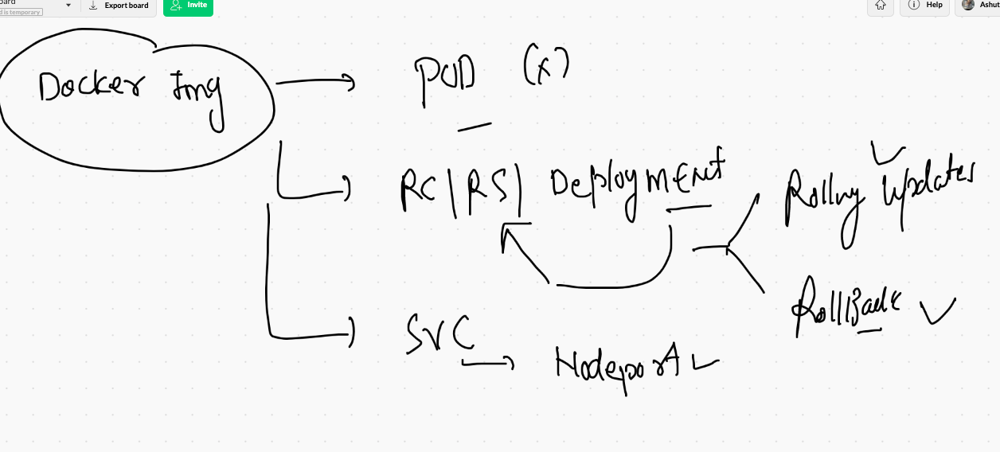
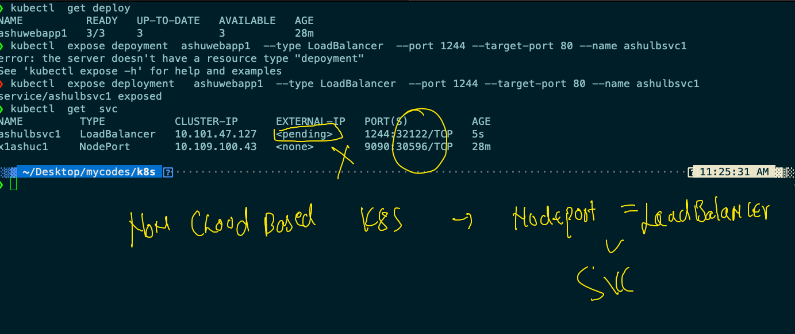
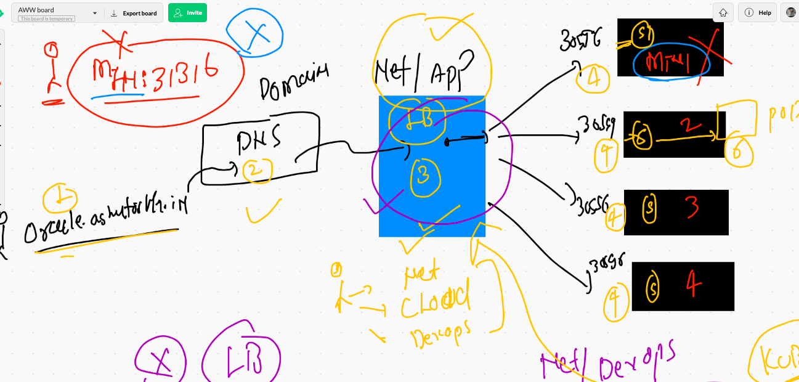
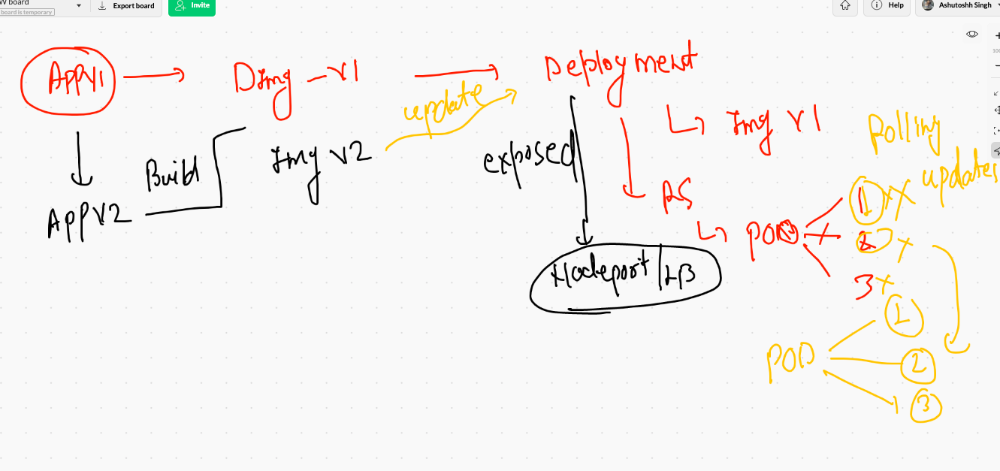
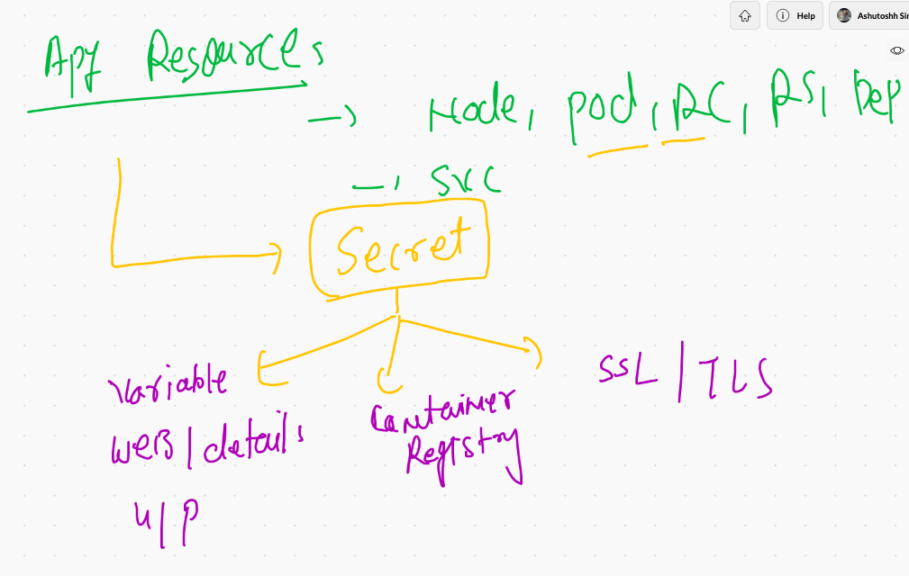
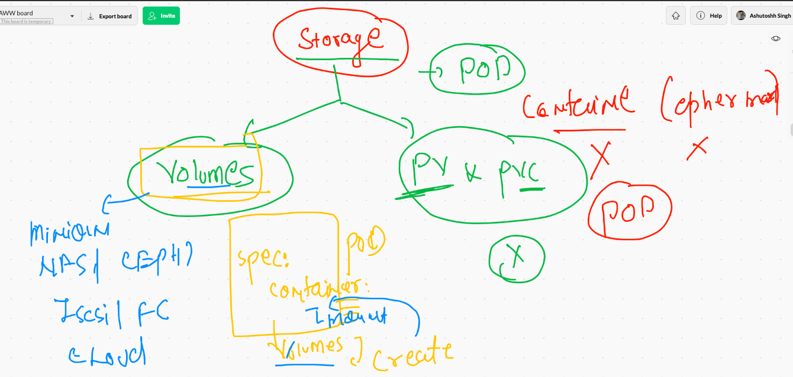
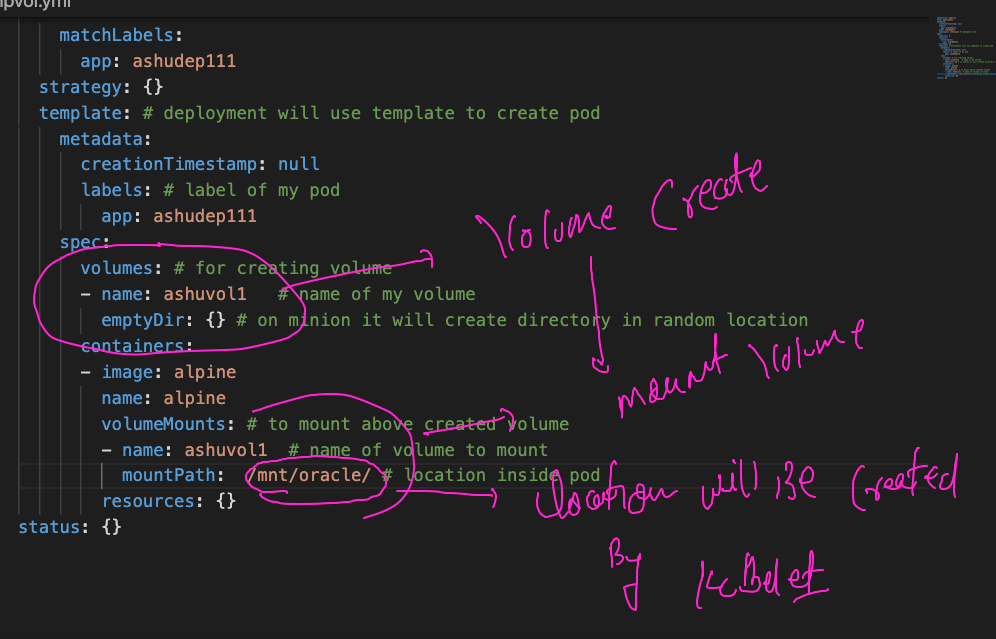

# Welcome to day5 Kubernetes training 

## recap 



## to check k8s token for dashboard

```
0050  kubectl  describe   secret  kubernetes-dashboard-token-p9sld  -n kubernetes-dashboard
❯ kubectl  describe   secret  kubernetes-dashboard-token-p9sld  -n kubernetes-dashboard
Name:         kubernetes-dashboard-token-p9sld
Namespace:    kubernetes-dashboard
Labels:       <none>
Annotations:  kubernetes.io/service-account.name: kubernetes-dashboard
              kubernetes.io/service-account.uid: d316e210-153e-4132-ab8b-51a843ffdd2f

Type:  kubernetes.io/service-account-token

Data
====
namespace:  20 bytes
token:      eyJhbGciOiJSUzI1NiIsImtpZCI6Il9jZWFxTGhVRmt6M3IwRmRSdnEyZnZWR1phemNjMUtTNHh2c3VpMVk5VjAifQ.eyJpc3MiOiJrdWJlcm5ldGVzL3NlcnZpY2VhY2NvdW50Iiwia3ViZXJuZXRlcy5pby9zZXJ2aWNlYWNjb3VudC9uYW1lc3BhY2UiOiJrdWJlcm5ldGVzLWRhc2hib2FyZCIsImt1YmVybmV0ZXMuaW8vc2VydmljZWFjY291bnQvc2VjcmV0Lm5hbWUiOiJrdWJlcm5ldGVzLWRhc2hib2FyZC10b2tlbi1wOXNsZCIsImt1YmVybmV0ZXMuaW8vc2VydmljZWFjY291bnQvc2VydmljZS1hY2NvdW50Lm5hbWUiOiJrdWJlcm5ldGVzLWRhc2hib2FyZCIsImt1YmVybmV0ZXMuaW8vc2VydmljZWFjY291bnQvc2VydmljZS1hY2NvdW50LnVpZCI6ImQzMTZlMjEwLTE1M2UtNDEzMi1hYjhiLTUxYTg0M2ZmZGQyZiIsInN1YiI6InN5c3RlbTpzZXJ2aWNlYWNjb3VudDprdWJlcm5ldGVzLWRhc2hib2FyZDprdWJlcm5ldGVzLWRhc2hib2FyZCJ9.wUCkqjw1bn4ucgqdfGPhaZPxbTpj1F4cgYlVxN4yplIUm6hCu5ZRHOA9N6ll3OsmJLEQDMs5hWw2HjRVvzImrCjNtaF-32Z5eau0PQ1BORV777BbKumSkTm9ydaC719pgkRQPx3SE0iwdXNH4AhmIq-mtgzuq4_Nw3iGR6_QeB
ca.crt:     1066 bytes


```


## Starting deployment in k8s again 

### deploying web app

```
kubectl  create  deployment  ashuwebapp1  --image=dockerashu/nginxor:v1  --dry-run=client -o yaml >nginxweb.yaml
```

### deleting all from my namespace

```
❯ kubectl   delete all --all -n ashuspace
pod "ashudeploy1-7b8874b7d8-r8qv5" deleted
pod "ashupod-1" deleted
pod "ashupod-2" deleted
pod "ashuwebpod" deleted
service "ashusvc1" deleted
deployment.apps "ashudeploy1" deleted

```

### after deployment we are creating service

```
❯ kubectl  get deploy
NAME          READY   UP-TO-DATE   AVAILABLE   AGE
ashuwebapp1   1/1     1            1           2m58s
❯ kubectl expose deployment  ashuwebapp1  --type NodePort  --port 1234 --target-port 80 --name ashusvc1
service/ashusvc1 exposed
❯ kubectl  get  svc
NAME       TYPE       CLUSTER-IP      EXTERNAL-IP   PORT(S)          AGE
ashusvc1   NodePort   10.100.10.167   <none>        1234:31316/TCP   6s

```

## final deployment 

```
❯ ls
ashudep.yml   ashupod1.yaml ashurc.yaml   ashusvc1.yaml ashuwebapp    nginxweb.yaml pod1.json     webpod1.yaml
❯ kubectl  apply -f  nginxweb.yaml
deployment.apps/ashuwebapp1 created
❯ kubectl  get  deployment
NAME          READY   UP-TO-DATE   AVAILABLE   AGE
ashuwebapp1   1/1     1            1           19s
❯ kubectl  get  po
NAME                          READY   STATUS    RESTARTS   AGE
ashuwebapp1-84889dcbf-f4bck   1/1     Running   0          25s
❯ kubectl  expose deployment  ashuwebapp1  --type NodePort --port 9090  --target-port 80 --name x1ashuc1
service/x1ashuc1 exposed
❯ kubectl  get  svc
NAME       TYPE       CLUSTER-IP      EXTERNAL-IP   PORT(S)          AGE
x1ashuc1   NodePort   10.109.100.43   <none>        9090:30596/TCP   7s

```

### scaling application 

```
❯ kubectl  get deploy
NAME          READY   UP-TO-DATE   AVAILABLE   AGE
ashuwebapp1   1/1     1            1           7m57s
❯ kubectl  scale deployment  ashuwebapp1  --replicas=3
deployment.apps/ashuwebapp1 scaled
❯ kubectl  get deploy
NAME          READY   UP-TO-DATE   AVAILABLE   AGE
ashuwebapp1   3/3     3            3           8m19s
❯ kubectl  get  po
NAME                          READY   STATUS    RESTARTS   AGE
ashuwebapp1-84889dcbf-7pnzt   1/1     Running   0          13s
ashuwebapp1-84889dcbf-f4bck   1/1     Running   0          8m28s
ashuwebapp1-84889dcbf-wls6f   1/1     Running   0          13s

```

## loadbalancer service



## final end to end deployment 




## rolling updates 



## UPgrading. application 

### checking existing docker image version in deployment 

```
❯ kubectl  describe  deploy  ashuwebapp1
Name:                   ashuwebapp1
Namespace:              ashuspace
CreationTimestamp:      Fri, 07 May 2021 10:56:12 +0530
Labels:                 app=ashuwebapp1
Annotations:            deployment.kubernetes.io/revision: 1
Selector:               app=ashuwebapp1
Replicas:               3 desired | 3 updated | 3 total | 3 available | 0 unavailable
StrategyType:           RollingUpdate
MinReadySeconds:        0
RollingUpdateStrategy:  25% max unavailable, 25% max surge
Pod Template:
  Labels:  app=ashuwebapp1
  Containers:
   nginxor:
    Image:        dockerashu/nginxor:v11
    
```

### updataing image after build in deployment 

```
kubectl  set  image  deployment  ashuwebapp1  nginxor=dockerashu/nginxor:v22
deployment.apps/ashuwebapp1 image updated

```

### checking rolling updates

```
❯ kubectl  get  deploy
NAME          READY   UP-TO-DATE   AVAILABLE   AGE
ashuwebapp1   3/3     3            3           70m
❯ kubectl  get  po
NAME                          READY   STATUS    RESTARTS   AGE
ashuwebapp1-8c996979f-7sxdx   1/1     Running   0          59s
ashuwebapp1-8c996979f-dvrld   1/1     Running   0          61s
ashuwebapp1-8c996979f-fm9mp   1/1     Running   0          64s

```

### few more commands for k8s 

```
10128  kubectl  describe  deploy  ashuwebapp1 
10129  history
10130* kubectl  describe  deploy  ashuwebapp1 
10131  kubectl  set  image  deployment  ashuwebapp1  nginxor=dockerashu/nginxor:v22
10132* kubectl  describe  deploy  ashuwebapp1 
10133  kubectl  get  deploy 
10134  kubectl  get  po
10135  kubectl  exec -it ashuwebapp1-8c996979f-7sxdx  -- bash 
❯ kubectl  rollout  undo  deployment ashuwebapp1
deployment.apps/ashuwebapp1 rolled back

```
## Deploying private registry images in k8s 

### pushing image in ACR 

```
❯ docker  tag alpine:latest   oracle.azurecr.io/alpine:v1
❯ 
❯ docker  login  oracle.azurecr.io   -u  oracle
Password: 
Login Succeeded
❯ docker push  oracle.azurecr.io/alpine:v1
The push refers to repository [oracle.azurecr.io/alpine]
b2d5eeeaba3a: Pushed 
v1: digest: sha256:def822f9851ca422481ec6fee59a9966f12b351c62ccb9aca841526ffaa9f748 size: 528
❯ docker  logout   oracle.azurecr.io
Removing login credentials for oracle.azurecr.io

```

### creating pod/depoyment 

```
kubectl   run   ashupodx1  --image=oracle.azurecr.io/alpine:v1   --dry-run=client  -o  yaml  >acrpod.yml

```

### got an error 

```
 kubectl  apply -f  acrpod.yml
 ❯ kubectl  get  po
NAME                          READY   STATUS             RESTARTS   AGE
ashupodx1                     0/1     ImagePullBackOff   0          2m11s

```

# Introduction to secret 



## creating secret 

```
❯ kubectl  create secret   docker-registry  ashuimgsec  --docker-server oracle.azurecr.io  --docker-username oracle --docker-password 1PmmRn7uDMRtVamX9 -n ashuspace
secret/ashuimgsec created
❯ kubectl  get  secret
NAME                  TYPE                                  DATA   AGE
ashuimgsec            kubernetes.io/dockerconfigjson        1      21s

```

### updating image pull secret

```
❯ kubectl apply -f  acrpod.yml
error: error validating "acrpod.yml": error validating data: ValidationError(Pod.spec): unknown field "imagePullSecret" in io.k8s.api.core.v1.PodSpec; if you choose to ignore these errors, turn validation off with --validate=false
❯ kubectl apply -f  acrpod.yml
The Pod "ashupodx1" is invalid: spec: Forbidden: pod updates may not change fields other than `spec.containers[*].image`, `spec.initContainers[*].image`, `spec.activeDeadlineSeconds` or `spec.tolerations` (only additions to existing tolerations)
  core.PodSpec{
  	... // 11 identical fields
  	NodeName:         "k8s-minion2",
  	SecurityContext:  &{},
- 	ImagePullSecrets: []core.LocalObjectReference{{Name: "ashuimgsec"}},
+ 	ImagePullSecrets: nil,
  	Hostname:         "",
  	Subdomain:        "",
  	... // 14 identical fields
  }

❯ kubectl replace -f  acrpod.yml --force
pod "ashupodx1" deleted
pod/ashupodx1 replaced

```

### checking logs 

```
❯ kubectl replace -f  acrpod.yml --force
pod "ashupodx1" deleted
pod/ashupodx1 replaced
❯ kubectl  get  po
NAME                          READY   STATUS    RESTARTS   AGE
ashupodx1                     1/1     Running   0          7s
ashuwebapp1-84889dcbf-cm8zt   1/1     Running   0          43m
ashuwebapp1-84889dcbf-fkr78   1/1     Running   0          43m
ashuwebapp1-84889dcbf-rxghx   1/1     Running   0          43m
❯ kubectl  logs  ashupodx1
PING fb.com (157.240.229.35): 56 data bytes
64 bytes from 157.240.229.35: seq=0 ttl=50 time=0.750 ms
64 bytes from 157.240.229.35: seq=1 ttl=50 time=1.389 ms
64 bytes from 157.240.229.35: seq=2 ttl=50 time=0.790 ms
64 bytes from 157.240.229.35: seq=3 ttl=50 time=0.769 ms
64 bytes from 157.240.229.35: seq=4 ttl=50 time=0.793 ms

```

## Storage in k8s 



### storage options 

[k8s_volumes](https://kubernetes.io/docs/concepts/storage/volumes/)

### cleaning up namespace 

```
❯ kubectl  get  all
NAME                              READY   STATUS    RESTARTS   AGE
pod/ashupodx1                     1/1     Running   0          120m
pod/ashuwebapp1-84889dcbf-cm8zt   1/1     Running   0          164m
pod/ashuwebapp1-84889dcbf-fkr78   1/1     Running   0          164m
pod/ashuwebapp1-84889dcbf-rxghx   1/1     Running   0          164m

NAME                 TYPE           CLUSTER-IP      EXTERNAL-IP   PORT(S)          AGE
service/ashulbsvc1   LoadBalancer   10.101.47.127   <pending>     1244:32122/TCP   3h30m
service/x1ashuc1     NodePort       10.109.100.43   <none>        9090:30596/TCP   3h59m

NAME                          READY   UP-TO-DATE   AVAILABLE   AGE
deployment.apps/ashuwebapp1   3/3     3            3           4h

NAME                                    DESIRED   CURRENT   READY   AGE
replicaset.apps/ashuwebapp1-84889dcbf   3         3         3       4h
replicaset.apps/ashuwebapp1-8c996979f   0         0         0       170m
❯ kubectl  delete all --all
pod "ashupodx1" deleted
pod "ashuwebapp1-84889dcbf-cm8zt" deleted
pod "ashuwebapp1-84889dcbf-fkr78" deleted
pod "ashuwebapp1-84889dcbf-rxghx" deleted
service "ashulbsvc1" deleted
service "x1ashuc1" deleted
deployment.apps "ashuwebapp1" deleted


```
## Creating deployment with emptyDir volume type 

```
kubectl  create  deployment   ashudep111   --image=alpine  --namespace ashuspace --dry-run=client -o yaml  >empvol.yml

```

### understanding volume creation and mounting 



### checking file system of running pod 

```
❯ kubectl  apply  -f  empvol.yml
deployment.apps/ashudep111 created
❯ kubectl  get  deploy
NAME         READY   UP-TO-DATE   AVAILABLE   AGE
ashudep111   1/1     1            1           7s
❯ kubectl  get   po
NAME                         READY   STATUS    RESTARTS   AGE
ashudep111-899dd4d84-jwzjk   1/1     Running   0          14s
❯ kubectl  exec -it  ashudep111-899dd4d84-jwzjk   -- sh
/ # cd  /mnt/oracle/
/mnt/oracle # ls
time.txt
/mnt/oracle # cat time.txt 
Fri May  7 09:46:52 UTC 2021
Fri May  7 09:46:55 UTC 2021
Fri May  7 09:46:58 UTC 2021
Fri May  7 09:47:01 UTC 2021
Fri May  7 09:47:04 UTC 2021
Fri May  7 09:47:07 UTC 2021

```

## side-car design pattern in k8s 


## accessing multiple container in the pod 

```
❯ kubectl  apply -f  empvol.yml
deployment.apps/ashudep111 configured
❯ kubectl  get  deploy
NAME         READY   UP-TO-DATE   AVAILABLE   AGE
ashudep111   1/1     1            1           22m
❯ kubectl  get  po
NAME                          READY   STATUS        RESTARTS   AGE
ashudep111-6c5c56d58b-spqzs   2/2     Running       0          29s
ashudep111-899dd4d84-jwzjk    1/1     Terminating   0          22m
❯ kubectl  get  po
NAME                          READY   STATUS    RESTARTS   AGE
ashudep111-6c5c56d58b-spqzs   2/2     Running   0          59s
❯ kubectl  exec -it ashudep111-6c5c56d58b-spqzs   -- sh
Defaulted container "ashuc1" out of: ashuc1, alpine
# 
❯ kubectl  exec -it ashudep111-6c5c56d58b-spqzs -c  alpine   -- sh
/ # exit
❯ kubectl  exec -it ashudep111-6c5c56d58b-spqzs -c  ashuc1  -- bash
root@ashudep111-6c5c56d58b-spqzs:/# cd /usr/share/nginx/html/
root@ashudep111-6c5c56d58b-spqzs:/usr/share/nginx/html# ls
time.txt
root@ashudep111-6c5c56d58b-spqzs:/usr/share/nginx/html# exit
exit

```

## few more commands 

```
10170  kubectl  create  deployment   ashudep111   --image=alpine  --dry-run=client -o yaml  >empvol.yml
10171  kubectl  create  deployment   ashudep111   --image=alpine  --namespace ashuspace --dry-run=client -o yaml  >empvol.yml
10172  ls
10173  kubectl  apply  -f  empvol.yml
10174  kubectl  get  deploy 
10175  kubectl  get   po 
10176  kubectl  exec -it  ashudep111-899dd4d84-jwzjk   -- sh 
10177  history
10178  kubectl  get  po 
10179  kubectl  get  deploy 
10180  ls
10181  kubectl  apply -f  empvol.yml
10182  kubectl  get  deploy  
10183  kubectl  get  po
10184  kubectl  exec -it ashudep111-6c5c56d58b-spqzs   -- sh 
10185  kubectl  exec -it ashudep111-6c5c56d58b-spqzs -c  alpine   -- sh 
10186  kubectl  exec -it ashudep111-6c5c56d58b-spqzs -c  ashuc1  -- bash 

```

### exposing service 

```
kubectl  expose deployment ashudep111  --type NodePort --port 1122 --target-port 80 --name  x1svc
service/x1svc exposed
❯ kubectl  get  svc
NAME    TYPE       CLUSTER-IP      EXTERNAL-IP   PORT(S)          AGE
x1svc   NodePort   10.102.54.111   <none>        1122:31529/TCP   5s

```


