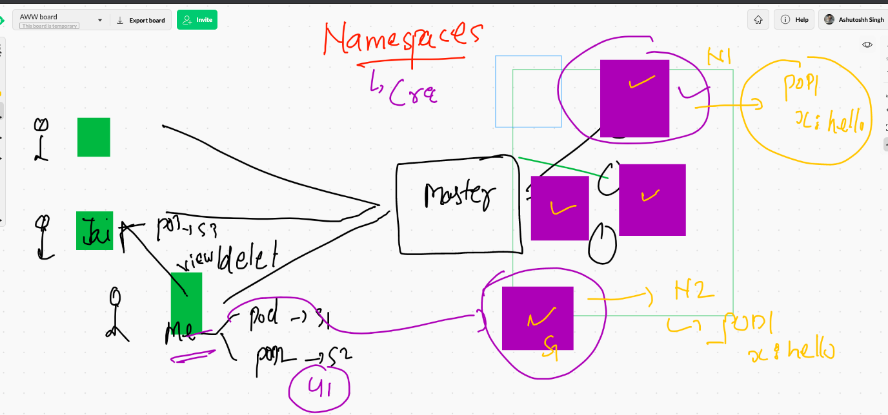
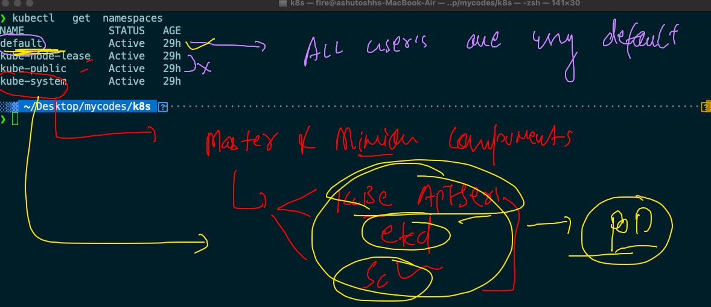
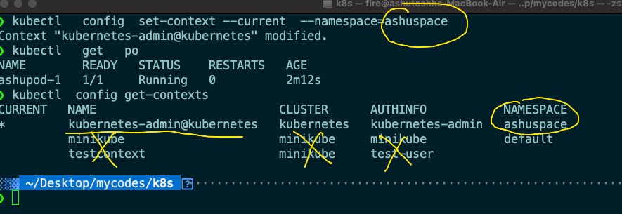
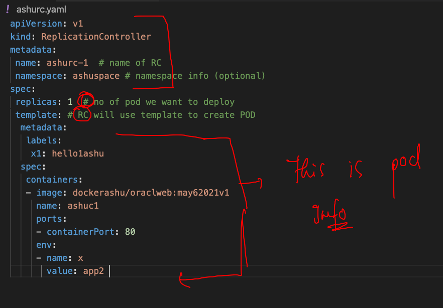

# getting started with Kubernetes 

## checking node status from client side 

```
 kubectl   get  no
NAME                            STATUS   ROLES                  AGE   VERSION
ip-172-31-72-151.ec2.internal   Ready    <none>                 24h   v1.21.0
k8s-master                      Ready    control-plane,master   24h   v1.21.0
k8s-minion2                     Ready    <none>                 24h   v1.21.0

```

### checking pods 

```
❯ kubectl   get  po
NAME          READY   STATUS             RESTARTS   AGE
amanpod-1     1/1     Running            1          16h
anshul-1      1/1     Running            1          16h
ashupod-1     1/1     Running            1          16h
hatpod        1/1     Running            1          16h
kpod-1        1/1     Running            1          16h
kptpod-11     1/1     Running            1          16h
namanpod1     1/1     Running            1          16h
nandhapod-1   1/1     Running            1          16h
nihapod-1     1/1     Running            1          16h
nodepod       0/1     CrashLoopBackOff   12         16h
rmnpod-1      1/1     Running            1          16h
ypod-1        1/1     Running            1          16h
❯ kubectl   get  po -o wide
NAME          READY   STATUS             RESTARTS   AGE   IP                NODE                            NOMINATED NODE   READINESS GATES
amanpod-1     1/1     Running            1          16h   192.168.27.209    k8s-minion2                     <none>           <none>
anshul-1      1/1     Running            1          16h   192.168.207.208   ip-172-31-72-151.ec2.internal   <none>           <none>
ashupod-1     1/1     Running            1          16h   192.168.207.207   ip-172-31-72-151.ec2.internal   <none>           <none>
hatpod        1/1     Running            1          16h   192.168.27.210    k8s-minion2                     <none>           <none>
kpod-1        1/1     Running        


```
### deleting pod

```
 kubectl  delete  pod ashupod-1 
 
 ===
 
 ❯ kubectl  delete  pods --all
pod "hatpod" deleted
pod "nihapod-1" deleted
pod "rmnpod-1" deleted
pod "ypod-1" deleted

```

### Multi app based webapp containerization and deployment 


## building web application docker image

```
❯ ls
Dockerfile deploy.sh  webapp1    webapp2
❯ docker  build  -t   dockerashu/oraclweb:may62021v1  .
Sending build context to Docker daemon  903.2kB
Step 1/11 : FROM oraclelinux:8.3
8.3: Pulling from library/oraclelinux
dd34f38d274c: Already exists 
Digest: sha256:af3182ee6c1e56f18fc1fecaf638da57d7c47233862e5c32f5ad723a6ab4c6db
Status: Downloaded newer image for oraclelinux:8.3
 ---> 816d99f0bbe8
Step 2/11 : MAINTAINER ashutoshh@linux.com
 ---> Running in fb74f7f06b62
Removing intermediate container fb74f7f06b62
 ---> e3264a9eb29a

```

### pushing image to docker hub 

```
❯ docker  login  -u dockerashu
Password: 
Login Succeeded
❯ docker push dockerashu/oraclweb:may62021v1
The push refers to repository [docker.io/dockerashu/oraclweb]
b29ff0e0d0d7: Pushed 
321abe9b6fbc: Pushed 
07b3fdaed24d: Pushed 
936303a7ba0e: Pushe

```

## Generating yaml file automatically 

```
kubectl  run ashuwebpod   --image=dockerashu/oraclweb:may62021v1   --port 80  --dry-run=client -o yaml
apiVersion: v1
kind: Pod
metadata:
  creationTimestamp: null
  labels:
    run: ashuwebpod
  name: ashuwebpod
spec:
  containers:
  - image: dockerashu/oraclweb:may62021v1
    name: ashuwebpod
    ports:
    - containerPort: 80
    resources: {}
  dnsPolicy: ClusterFirst
  restartPolicy: Always
status: {}

====

❯ kubectl  run ashuwebpod   --image=dockerashu/oraclweb:may62021v1   --port 80  --dry-run=client -o json
{
    "kind": "Pod",
    "apiVersion": "v1",
    "metadata": {
        "name": "ashuwebpod",
        "creationTimestamp": null,
        "labels": {
            "run": "ashuwebpod"
        }
    },
    "spec": {
        "containers": [
            {
                "name": "ashuwebpod",
                "image": "
                
                
 ```
 
 ## storing output in a file 
 
 ```
 10120  kubectl  run ashuwebpod   --image=dockerashu/oraclweb:may62021v1   --port 80  --dry-run=client -o yaml
10121  kubectl  run ashuwebpod   --image=dockerashu/oraclweb:may62021v1   --port 80  --dry-run=client -o json 
❯ kubectl  run ashuwebpod   --image=dockerashu/oraclweb:may62021v1   --port 80  --dry-run=client -o yaml   >webpod1.yaml

```

### Deploying app 

```
❯ kubectl  apply -f  webpod1.yaml --dry-run=client
pod/ashuwebpod created (dry run)
❯ kubectl  apply -f  webpod1.yaml
pod/ashuwebpod created
❯ kubectl  get  pods
NAME         READY   STATUS             RESTARTS   AGE
ashuwebpod   1/1     Running            0          5s

```

### common troubleshooting 


## access web app running in k8s cluster 

### case 1 when you are it self kubernetes client --

```
 kubectl  port-forward   ashuwebpod  1234:80
Forwarding from 127.0.0.1:1234 -> 80
Forwarding from [::1]:1234 -> 80
Handling connection for 1234
Handling connection for 1234


```

## problems with pod networking in term of end user accessment 


## introduction service 

### service gonna use label of pod to find out their information and then forward traffic over there


### labels to pod 


## service type in k8s


## nodeport service type 


### creating nodeport service 

```
❯ kubectl   create  service  nodeport  ashusvc1  --tcp  1234:80  --dry-run=client -o yaml
apiVersion: v1
kind: Service
metadata:
  creationTimestamp: null
  labels:
    app: ashusvc1
  name: ashusvc1
spec:
  ports:
  - name: 1234-80
    port: 1234
    protocol: TCP
    targetPort: 80
  selector:
    app: ashusvc1
  type: NodePort
status:
  loadBalancer: {}
❯ kubectl   create  service  nodeport  ashusvc1  --tcp  1234:80  --dry-run=client -o yaml  >ashusvc1.yaml

```

### deploying nodeport service type 


###  listing pod and service both 

```
❯ kubectl  get  pod,svc
NAME                  READY   STATUS    RESTARTS   AGE
pod/amanmultiwebpod   1/1     Running   0          3h8m
pod/anshul-1          1/1     Running   0          3h19m
pod/ashupod-1         1/1     Running   0          3h15m
pod/ashuwebpod        1/1     Running   1          3h23m
pod/hatwebpod         1/1     Running   0          3h22m
pod/keerthiwebpod     1/1     Running   0          3h14m
pod/kptwebpod         1/1     Running   0          3h21m
pod/namwebpod1        1/1     Running   0          3h12m
pod/nandhawebpod      1/1     Running   0          3h21m
pod/nihawebpod        1/1     Running   0          3h11m
pod/richikpod         1/1     Running   0          3h22m
pod/yyashwebpod       1/1     Running   0          3h19m

NAME                  TYPE        CLUSTER-IP       EXTERNAL-IP   PORT(S)          AGE
service/amansrv1      NodePort    10.108.136.63    <none>        1234:30116/TCP   95m
service/anshulc1      NodePort    10.96.239.214    <none>        1234:30658/TCP   93m
service/ashusvc1      NodePort    10.97.170.252    <none>        1234:32137/TCP   95m
service/hatser1       NodePort    10.97.80.169     <none>        1234:31445/TCP   94m
service/keerthisvc1   NodePort    10.104.106.150   <none>        1234:30501/TCP   94m
service/kubernetes    ClusterIP   10.96.0.1        <none>        443/TCP          29h
service/namsvc1       NodePort    10.97.12.110

```

### deleting pod and service 

```
❯ kubectl  delete all --all
pod "amanmultiwebpod" deleted
pod "anshul-1" deleted
pod "ashupod-1" deleted
pod "ashuwebpod" deleted
pod "hatwebpod" deleted
pod "keerthiwebpod" deleted
pod "kptwebpod" deleted
pod "namwebpod1" deleted
pod "nandhawebpod" deleted
pod "nihawebpod" deleted
pod "richikpod" deleted
pod "yyashwebpod" deleted
service "amansrv1" deleted
service "anshulc1" deleted
service "ashusvc1" deleted
service "hatser1" deleted
service "keerthisvc1" deleted
service "kubernetes" deleted
service "namsvc1" deleted
service "nandhasvc1" deleted
service "nihasvc1" deleted

```

# Namespace introduction 



## default namespaces in k8s



## checking k8s components

```
❯ kubectl  get  pods  -n kube-system
NAME                                      READY   STATUS    RESTARTS   AGE
calico-kube-controllers-b656ddcfc-bqm8f   1/1     Running   2          29h
calico-node-p557r                         1/1     Running   2          29h
calico-node-ptcwm                         1/1     Running   2          29h
calico-node-r7l5j                         1/1     Running   2          29h
coredns-558bd4d5db-2f6n9                  1/1     Running   2          29h
coredns-558bd4d5db-lsqnp                  1/1     Running   2          29h
etcd-k8s-master                           1/1     Running   2          29h
kube-apiserver-k8s-master                 1/1     Running   2          29h
kube-controller-manager-k8s-master        1/1     Running   2          29h
kube-proxy-47q8j                          1/1     Running   2          29h
kube-proxy-5pgkq                          1/1     Running   2          29h
kube-proxy-mhv9p                          1/1     Running   2          29h
kube-scheduler-k8s-master                 1/1     Running   2          29h

```


## creating custom namespaces 

```
❯ kubectl   create  namespace  ashuspace
namespace/ashuspace created
❯ kubectl   get   ns
NAME              STATUS   AGE
ashuspace         Active   7s
default           Active   29h
kube-node-lease   Active   29h
kube-public       Active   29h
kube-system       Active   29h

```

## deploying in your custom namespaces 

```
❯ kubectl  apply -f  ashupod1.yaml -n ashuspace
pod/ashupod-1 created
❯ kubectl  get  pods
No resources found in default namespace.
❯ kubectl  get  pods  -n ashuspace
NAME        READY   STATUS    RESTARTS   AGE
ashupod-1   1/1     Running   0          14s
❯ kubectl  delete pod  ashupod-1  -n ashuspace
pod "ashupod-1" deleted
❯ kubectl  get  pods  -n ashuspace
No resources found in ashuspace namespace.

```

## changing default namespace 

```
 kubectl   config  set-context --current  --namespace=ashuspace
 
 ```
 
 
 
# Replication controller 


## RC



## deployment of RC 

```
❯ ls
ashupod1.yaml ashurc.yaml   ashusvc1.yaml pod1.json     webpod1.yaml
❯ kubectl  apply  -f  ashurc.yaml
replicationcontroller/ashurc-1 created
service/ashusvc123 created
❯ kubectl   get   rc
NAME       DESIRED   CURRENT   READY   AGE
ashurc-1   1         1         1       7s
❯ kubectl   get   svc
NAME         TYPE       CLUSTER-IP     EXTERNAL-IP   PORT(S)          AGE
ashusvc123   NodePort   10.111.49.87   <none>        1234:30913/TCP   10s
❯ kubectl   get   rc
NAME       DESIRED   CURRENT   READY   AGE
ashurc-1   1         1         1       15s
❯ kubectl   get   pod
NAME             READY   STATUS    RESTARTS   AGE
ashupod-1        1/1     Running   0          34m
ashurc-1-xpspx   1/1     Running   0          20s

```

## if pod goes down RC will take care

```
❯ kubectl  get  rc
NAME       DESIRED   CURRENT   READY   AGE
ashurc-1   1         1         1       9m14s
❯ kubectl  get  po
NAME             READY   STATUS    RESTARTS   AGE
ashupod-1        1/1     Running   0          43m
ashurc-1-xpspx   1/1     Running   0          9m18s
❯ kubectl  get  po  -o  wide
NAME             READY   STATUS    RESTARTS   AGE     IP                NODE                            NOMINATED NODE   READINESS GATES
ashupod-1        1/1     Running   0          43m     192.168.27.224    k8s-minion2                     <none>           <none>
ashurc-1-xpspx   1/1     Running   0          9m23s   192.168.207.226   ip-172-31-72-151.ec2.internal   <none>           <none>
❯ kubectl  delete  pod ashurc-1-xpspx
pod "ashurc-1-xpspx" deleted
❯ kubectl  get  po  -o  wide
NAME             READY   STATUS    RESTARTS   AGE   IP               NODE          NOMINATED NODE   READINESS GATES
ashupod-1        1/1     Running   0          44m   192.168.27.224   k8s-minion2   <none>           <none>
ashurc-1-b5tq5   1/1     Running   0          44s   192.168.27.233   k8s-minion2   <none>           <none>

```

### manual scaling 

```
❯ kubectl  scale  rc  ashurc-1  --replicas=5
replicationcontroller/ashurc-1 scaled
❯ kubectl  get  po
NAME             READY   STATUS    RESTARTS   AGE
ashupod-1        1/1     Running   0          49m
ashurc-1-5tvbp   1/1     Running   0          109s
ashurc-1-8sq6z   1/1     Running   0          5s
ashurc-1-b5tq5   1/1     Running   0          6m29s
ashurc-1-khlfm   1/1     Running   0          5s
ashurc-1-qcdjg   1/1     Running   0          5s

```


