# Docker again 

## Intro to Namespaces & Cgroups 

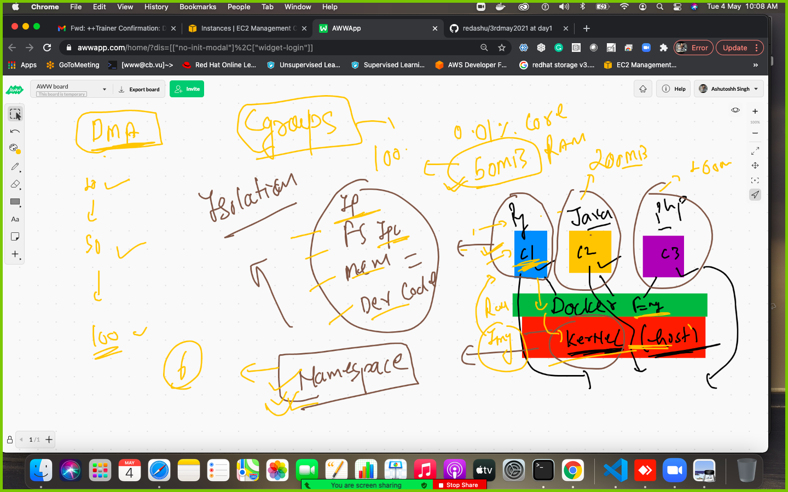

## checking stats of a container 

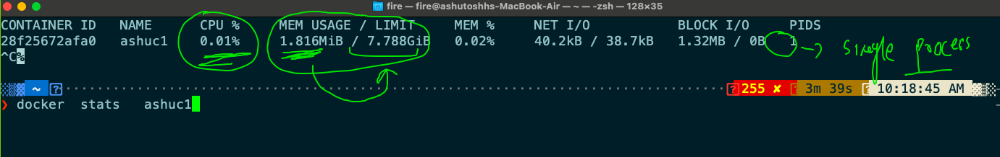

## memory restriction in a container 

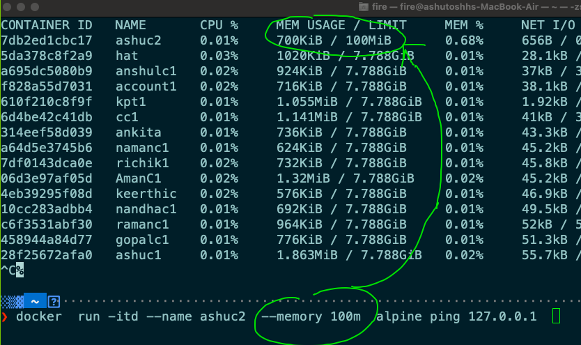

### little info about CPU (processor)

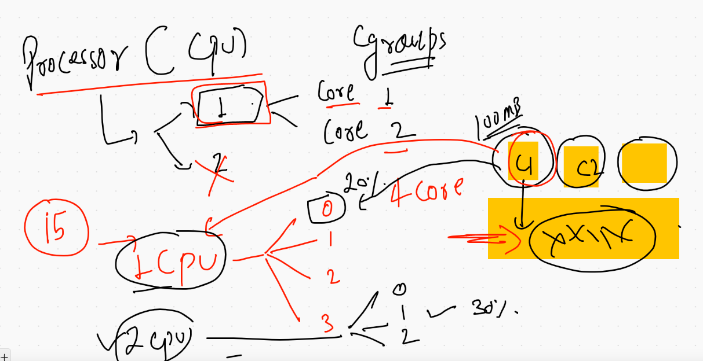

###  cgropus

```
docker  run -itd --name ashuc3  --memory 200m --cpuset-cpus=0 --cpu-shares=30    alpine ping 127.0.0.1
```

## for better understanding like performance tunning purpose 

[tunehostcontainer](https://docs.docker.com/config/containers/resource_constraints/)

## Restart policy in containers

[restartpolicy](https://docs.docker.com/config/containers/start-containers-automatically/)

### implementin restart policy 

```
docker  run -itd --name ashuc4  --restart always    alpine ping 127.0.0.1 
```

## filtering output from inspect of container 

```
10058  docker  inspect  ashuc4 
10059  docker  inspect  ashuc4  -f  '{{.Id}}'
10060  docker  inspect  ashuc4  --format='{{.Id}}'
10061  docker  inspect  ashuc4  --format='{{.State.Status}}'
10062* docker inspect  ashuc4  -f  '{{.HostConfig.RestartPolicy}}'
10063* docker inspect  ashuc4  -f  '{{.HostConfig.RestartPolicy.Name}}'

```

### info about container update command 

```
❯ docker  update  ashuc4  --restart always
ashuc4
❯ docker  update  --help

Usage:  docker update [OPTIONS] CONTAINER [CONTAINER...]

Update configuration of one or more containers

Options:
      --blkio-weight uint16        Block IO (relative weight), between 10 and 1000, or 0 to disable (default 0)
      --cpu-period int             Limit CPU CFS (Completely Fair Scheduler) period
      --cpu-quota int              Limit CPU CFS (Completely Fair Scheduler) quota
      --cpu-rt-period int          Limit the CPU real-time period in microseconds
      --cpu-rt-runtime int         Limit the CPU real-time runtime in microseconds
  -c, --cpu-shares int             CPU shares (relative weight)
      --cpus decimal               Number of CPUs
      --cpuset-cpus string         CPUs in which to allow execution (0-3, 0,1)
      --cpuset-mems string         MEMs in which to allow execution (0-3, 0,1)
      --kernel-memory bytes        Kernel memory limit
  -m, --memory bytes               Memory limit
      --memory-reservation bytes   Memory soft limit
      --memory-swap bytes          Swap limit equal to memory plus swap: '-1' to enable unlimited swap
      --pids-limit int             Tune container pids limit (set -1 for unlimited)
      --restart string             Restart policy to apply when a container exits
      
  ```
 
 ## Some info about installer 
 
 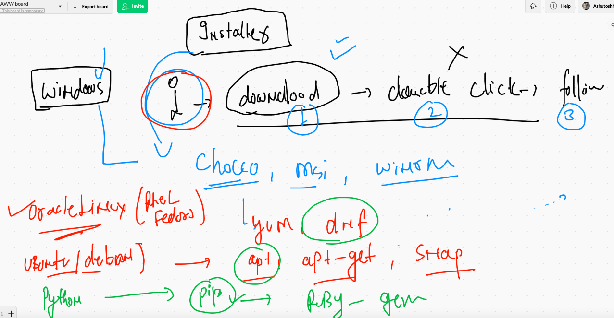
 
 ### building python3 based image using debian linux 
 
 ```
 ❯ docker  build  -t   ashudebpy:v001 -f  debain.dockerfile  .
Sending build context to Docker daemon  4.608kB
Step 1/7 : FROM debian
 ---> 0d587dfbc4f4
Step 2/7 : MAINTAINER ashutoshh@linux.com
 ---> Running in 80968f047851
Removing intermediate container 80968f047851
 ---> 4c569ed8f21e
Step 3/7 : RUN  apt  update &&   apt install python3 -y
 ---> Running in de72b1760eb7

```

## Creating container 

```
 docker  run -itd --name ashucx1  1ff5866381f6 
 
```

### Dockerfile example of java code 

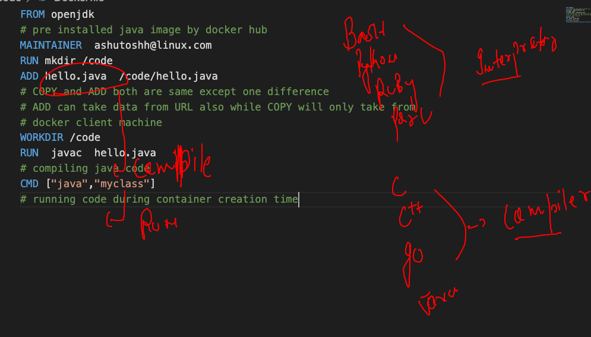

###  building image

```
❯ ls
Dockerfile hello.java
❯ docker  build  -t  ashujava:vv1  .
Sending build context to Docker daemon  3.072kB
Step 1/7 : FROM openjdk
 ---> 9991202d6ad6
Step 2/7 : MAINTAINER  ashutoshh@linux.com
 ---> Using cache
 ---> dc6a3f5cd577
Step 3/7 : RUN mkdir /code
 ---> Running in 6a48c95f42fe
Removing intermediate container 6a48c95f42fe
 ---> dfc173fce260
Step 4/7 : ADD hello.java  /code/hello.java
 ---> 50e00afde37a
Step 5/7 : WORKDIR /code
 ---> Running in 17c22d726ca4
Removing intermediate container 17c22d726ca4
 ---> 64eada987913
Step 6/7 : RUN  javac  hello.java
 ---> Running in 9e35b0748580
Removing intermediate container 9e35b0748580
 ---> 23796735ae49
Step 7/7 : CMD ["java","myclass"]
 ---> Running in 54d56d5254b5
Removing intermediate container 54d56d5254b5
 ---> 8547f089e5a2
Successfully built 8547f089e5a2
Successfully tagged ashujava:vv1

```


### creating containers

```
10104  docker  run -dit  --name ashujc1  ashujava:vv1  
10105  docker  ps
10106  docker  logs  -f  ashujc1 
❯ docker ps
CONTAINER ID   IMAGE             COMMAND                  CREATED              STATUS              PORTS     NAMES
ebfe25e8cd05   keerthijava:vv1   "java hello"             27 seconds ago       Up 15 seconds                 keerthic1
e4139cdd9313   ashujava:vv1      "java myclass"           54 seconds ago       Up 43 seconds                 ashujc1
21f0f0b7e0e5   anuragjava:v11    "java myclass"           About a minute ago   Up About a minute             anuragc3
eb70f6aae559   gopaljdk:v001     "java myclass"           About a minute ago   Up About a minute             gopalc2

```

## Sharing docker images over the different docker Host 

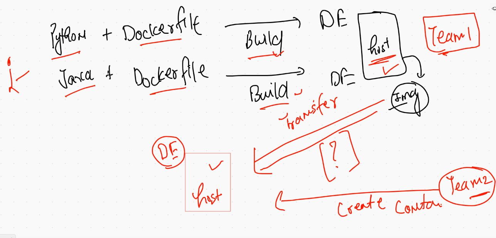

## image registry discussion 

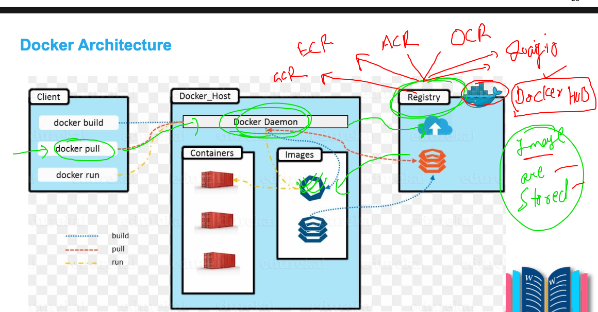

## docker hub and image name reality 

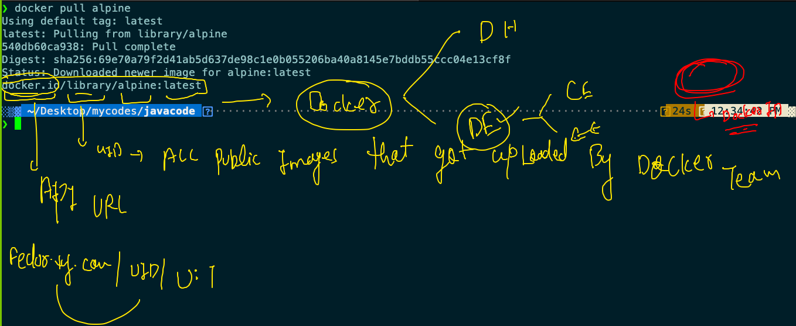

## steps to push image on docker hub 

### tagging 

```
docker  tag   ashudebpy:v001  dockerashu/ashudebpy:v111
```
### login to docker hub from docker client machine 

```
❯ docker login
Login with your Docker ID to push and pull images from Docker Hub. If you don't have a Docker ID, head over to https://hub.docker.com to create one.
Username: dockerashu
Password: 
Login Succeeded

```

### pushing image to docker hub 

```
❯ docker push  dockerashu/ashudebpy:v111
The push refers to repository [docker.io/dockerashu/ashudebpy]
32a477da7692: Pushed 
87b647b578ef: Pushed 
18c6382c9c2b: Pushed 
e2c6ff462357: Mounted from library/debian 
v111: digest: sha256:6f0e39c022207827bd4cf953b51daed4f7e790f6836f79d98958ba86688e6fcd size: 1155

```

# Docker Networking 

## getting started 

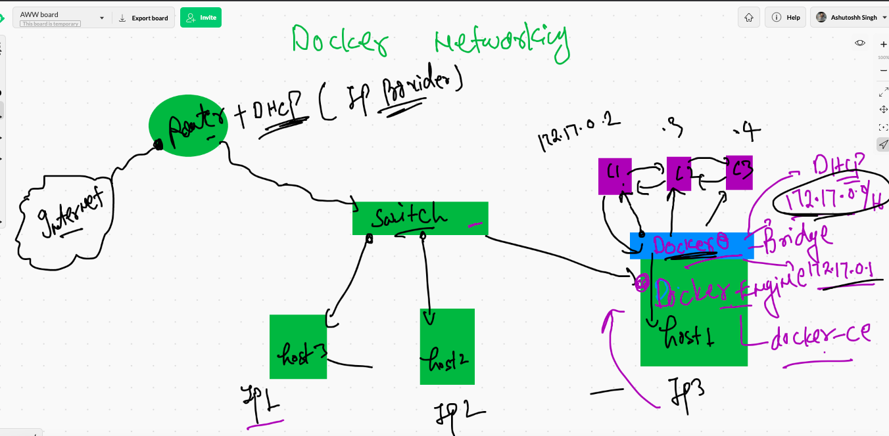

## creating container and checking ip address 

```
 docker  run -itd --name ashuc1  alpine ping fb.com 
docker  inspect  ashuc1  -f '{{.NetworkSettings.IPAddress}}'
172.17.0.2

```

### access container 

```
❯ docker  exec -it  ashuc1  sh
/ # 
/ # 
/ # ifconfig 
eth0      Link encap:Ethernet  HWaddr 02:42:AC:11:00:02  
          inet addr:172.17.0.2  Bcast:172.17.255.255  Mask:255.255.0.0
          UP BROADCAST RUNNING MULTICAST  MTU:1500  Metric:1
          RX packets:368 errors:0 dropped:0 overruns:0 frame:0
          TX packets:350 errors:0 dropped:0 overruns:0 carrier:0
          collisions:0 txqueuelen:0 
          RX bytes:34164 (33.3 KiB)  TX bytes:32932 (32.1 KiB)

lo        Link encap:Local Loopback  
          inet addr:127.0.0.1  Mask:255.0.0.0
          UP LOOPBACK RUNNING  MTU:65536  Metric:1
          RX packets:0 errors:0 dropped:0 overruns:0 frame:0
          TX packets:0 errors:0 dropped:0 overruns:0 carrier:0
          collisions:0 txqueuelen:1000 
          RX bytes:0 (0.0 B)  TX bytes:0 (0.0 B)

/ # ping  172.17.0.3
PING 172.17.0.3 (172.17.0.3): 56 data bytes
64 bytes from 172.17.0.3: seq=0 ttl=255 time=0.137 ms
64 bytes from 172.17.0.3: seq=1 ttl=255 time=0.078 ms
64 bytes from 172.17.0.3: seq=2 ttl=255 time=0.078 ms
^C
--- 172.17.0.3 ping statistics ---

```

### NAT in docker networking 

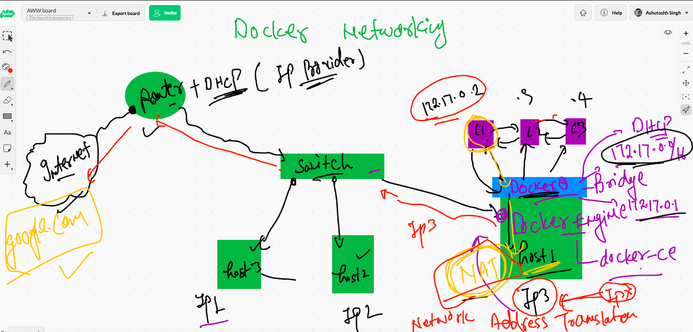

## port forwarding will be used in docker host to connect from external source to container app

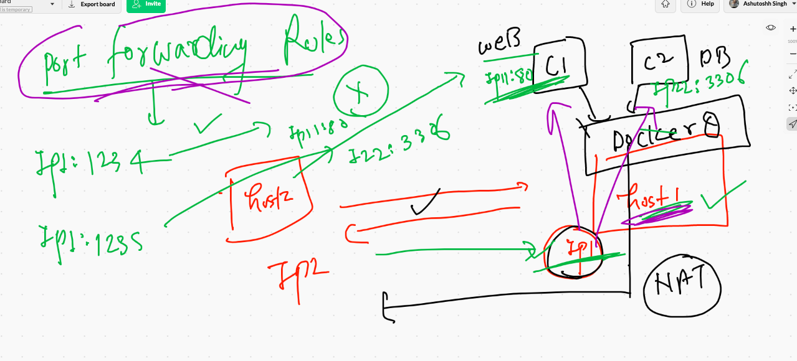

## webapplication and web servers 

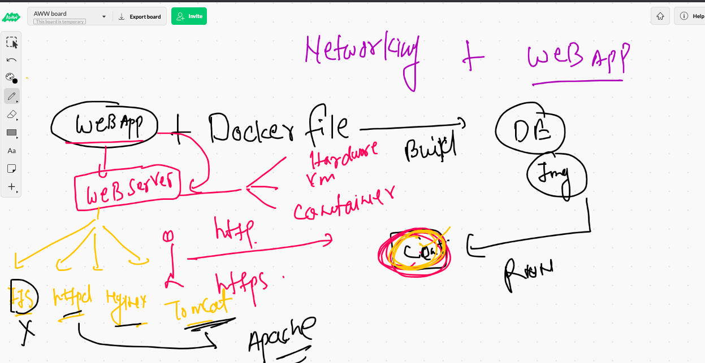

## choosing webserver 

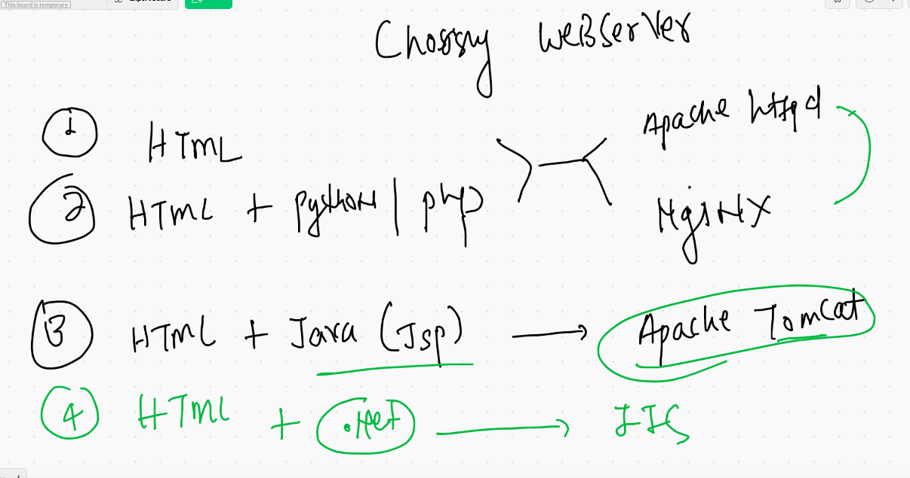

### apache httpd dockerfile

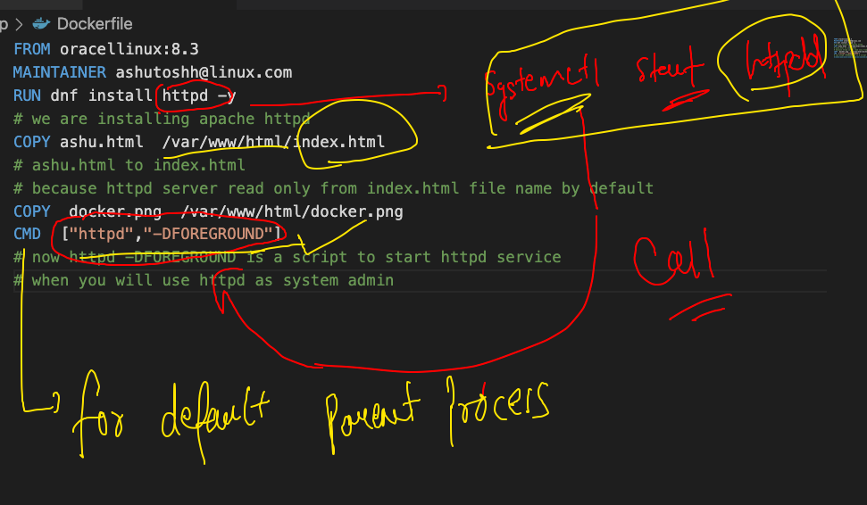

### image got build

```
❯ docker build  -t  ashuwebapp:oraclev1 .
Sending build context to Docker daemon  65.54kB
Step 1/6 : FROM oraclelinux:8.3
 ---> 816d99f0bbe8
Step 2/6 : MAINTAINER ashutoshh@linux.com
 ---> Using cache
 ---> c0f636b572b7
Step 3/6 : RUN dnf install httpd -y
 ---> Using cache
 ---> a958c510ced5
Step 4/6 : COPY ashu.html  /var/www/html/index.html
 ---> 3ae104383e9c
Step 5/6 : COPY  docker.png  /var/www/html/docker.png
 ---> d8c255d754b3
Step 6/6 : ENTRYPOINT httpd -DFOREGROUND
 ---> Running in 31bcb8069d02
Removing intermediate container 31bcb8069d02
 ---> 9714719ae336
Successfully built 9714719ae336
Successfully tagged ashuwebapp:oraclev1

```

### Deploying web application in container with host port forwarding rule 

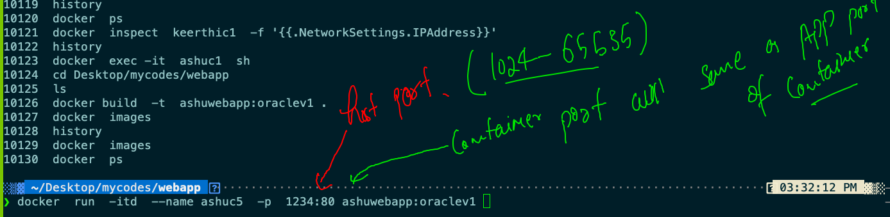

## Never prefer using docker0 bridge 

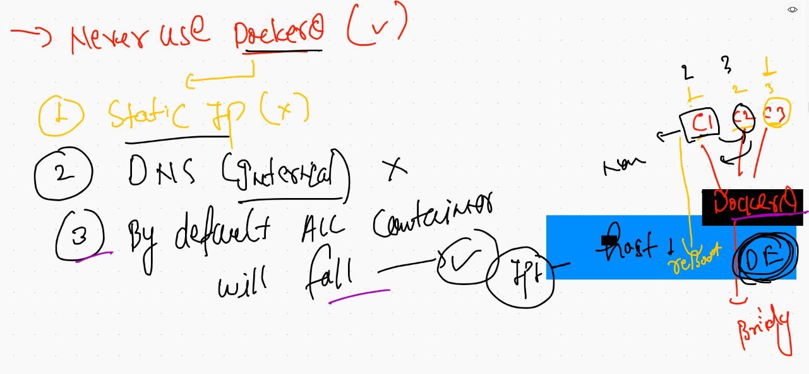

## custom bridge game 

```
10079  docker  network    create  ashubr1  --subnet  192.168.100.0/24 
10080  docker  network   ls
10081  docker run -it --rm  --network  none  alpine sh 
10082  docker run -it --rm  --network  host   alpine sh 
❯ docker  network   ls
NETWORK ID     NAME          DRIVER    SCOPE
fbb2c2a11b3f   Testb1        bridge    local
9ab09523a3fa   anshulhttpd   bridge    local
f9b6d4ae9747   anuragb1      bridge    local
0758dd9aaee6   ashubr1       bridge    local
e7382dd86266   bridge        bridge    local
87e51b407d02   host          host      local
dde5822b2a51   nandhanw      bridge    local
ec2c48f04c56   none          null      local
❯ docker  network   ls
NETWORK ID     NAME          DRIVER    SCOPE
fbb2c2a11b3f   Testb1        bridge    local
ebcdfb194f99   amang99       bridge    local
aaebf0be5428   ankita        bridge    local
9ab09523a3fa   anshulhttpd   bridge    local
f9b6d4ae9747   anuragb1      bridge    local
0758dd9aaee6   ashubr1       bridge    local
e7382dd86266   bridge        bridge    local
87e51b407d02   host          host      local
b4db080e8b86   nambr1        bridge    local
dde5822b2a51   nandhanw      bridge    local
ec2c48f04c56   none          null      local
b20b02c94c31   yyashbr1      bridge    local
❯ docker  run -itd --name ashuc111  --network ashubr1  alpine ping 127.0.0.1
0e8fdf340650a400bfaec6abf34cad573502cd84d0374bef783f0829bba8d5b3
❯ docker  run -itd --name ashuc222 --network ashubr1 --ip 192.168.100.30  alpine ping 127.0.0.1
c4ec7761ec2eca4bc806999470fdcece1bf644864228ef92a440ba1d7262e978

```


## checking connection 

```
❯ docker  exec -it  ashuc111 sh
/ # ifconfig 
eth0      Link encap:Ethernet  HWaddr 02:42:C0:A8:64:02  
          inet addr:192.168.100.2  Bcast:192.168.100.255  Mask:255.255.255.0
          UP BROADCAST RUNNING MULTICAST  MTU:1500  Metric:1
          RX packets:16 errors:0 dropped:0 overruns:0 frame:0
          TX packets:0 errors:0 dropped:0 overruns:0 carrier:0
          collisions:0 txqueuelen:0 
          RX bytes:1312 (1.2 KiB)  TX bytes:0 (0.0 B)

lo        Link encap:Local Loopback  
          inet addr:127.0.0.1  Mask:255.0.0.0
          UP LOOPBACK RUNNING  MTU:65536  Metric:1
          RX packets:304 errors:0 dropped:0 overruns:0 frame:0
          TX packets:304 errors:0 dropped:0 overruns:0 carrier:0
          collisions:0 txqueuelen:1000 
          RX bytes:25536 (24.9 KiB)  TX bytes:25536 (24.9 KiB)

/ # ping 192.168.100.30
PING 192.168.100.30 (192.168.100.30): 56 data bytes
64 bytes from 192.168.100.30: seq=0 ttl=255 time=0.121 ms
64 bytes from 192.168.100.30: seq=1 ttl=255 time=0.089 ms
^C
--- 192.168.100.30 ping statistics ---
2 packets transmitted, 2 packets received, 0% packet loss
round-trip min/avg/max = 0.089/0.105/0.121 ms
/ # ping ashuc222
PING ashuc222 (192.168.100.30): 56 data bytes
64 bytes from 192.168.100.30: seq=0 ttl=255 time=0.128 ms
64 bytes from 192.168.100.30: seq=1 ttl=255 time=0.093 ms
64 bytes from 192.168.100.30: seq=2 ttl=255 time=10.063 ms
64 bytes from 192.168.100.30: seq=3 ttl=255 time=0.221 ms
^C
--- ashuc222 ping statistics ---
4 packets transmitted, 4 packets received, 0% packet loss
round-trip min/avg/max = 0.093/2.626/10.063 ms
/ # 

```

### connecting & disconnecting container from bridges 

```
10102  docker run -itd --name x1 --network ashubr1  alpine ping 127.0.0.1
10103  docker network ls
10104  docker  network connect  Testb1   x1 
10105  docker  exec -it  x1 sh 
❯ docker  network disconnect  Testb1   x1


```
# Storage concept in docker 

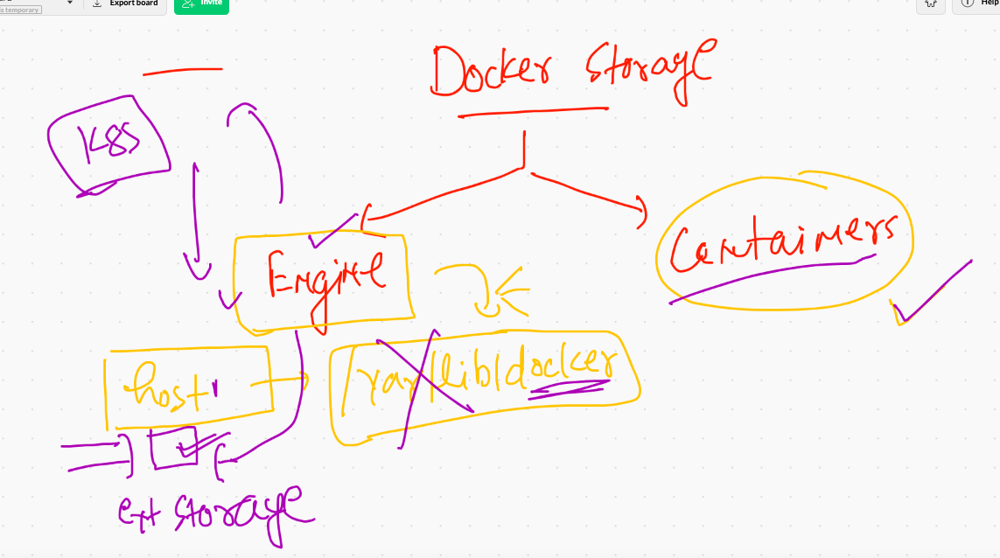


## docker container storage ideas

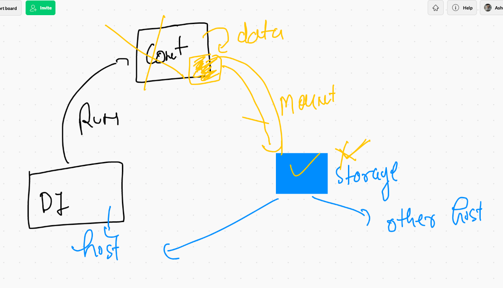


  
