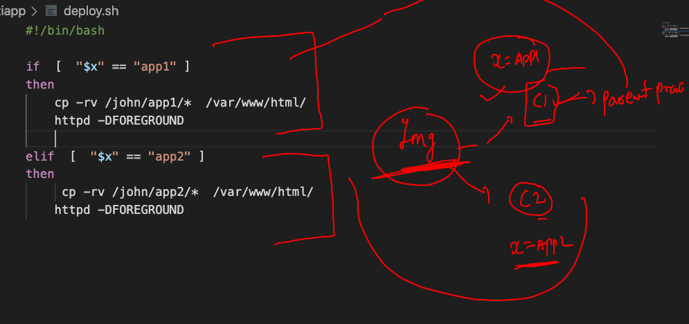
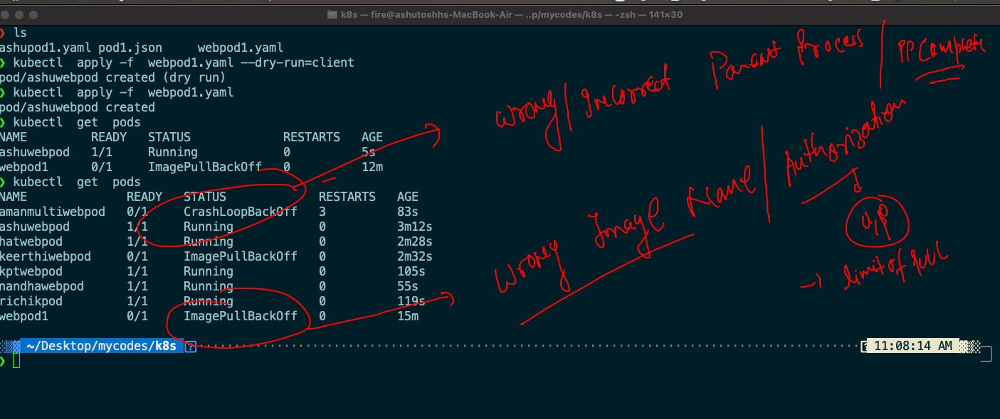
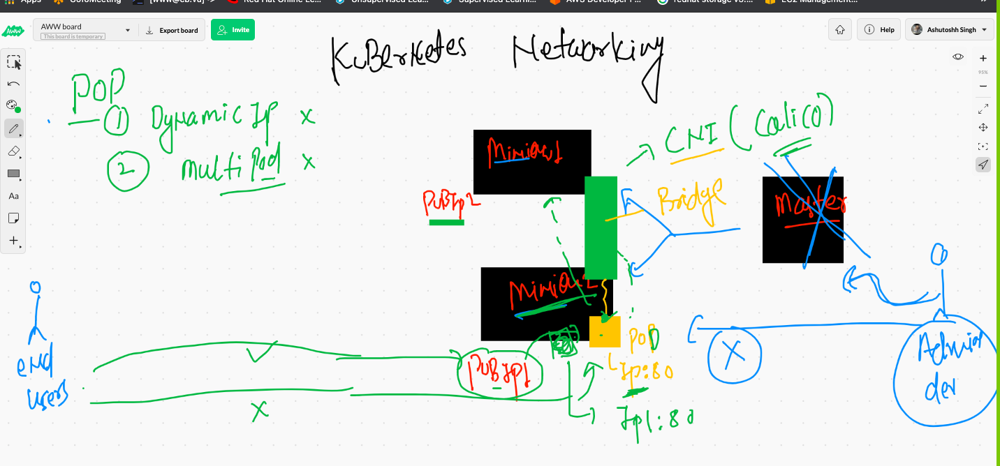
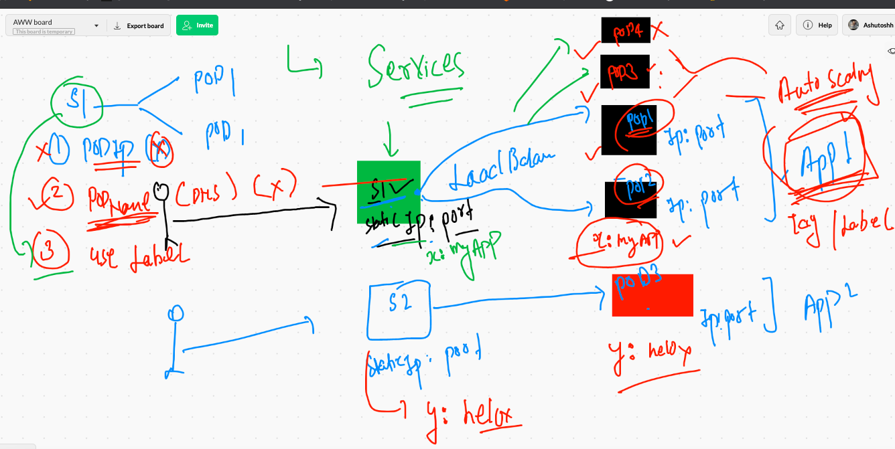
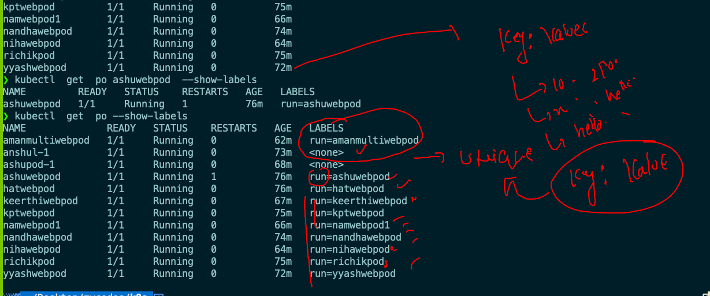
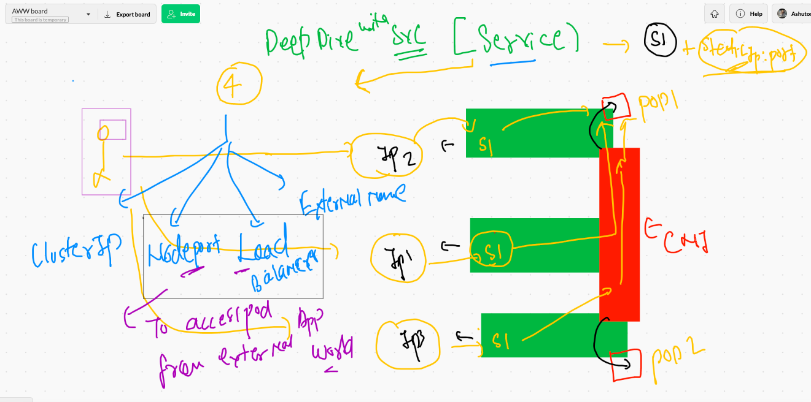
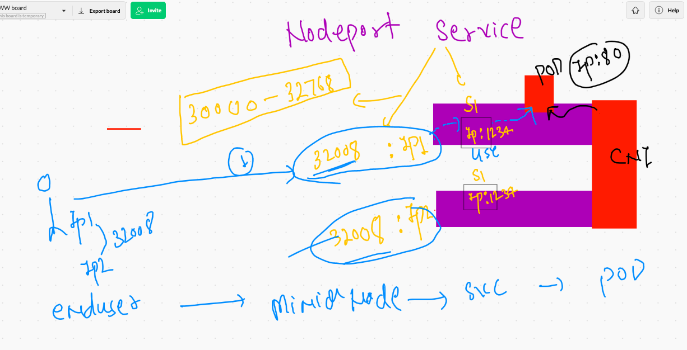
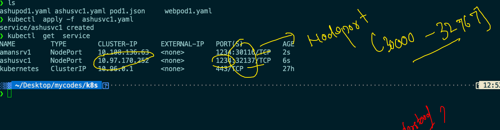

# getting started with Kubernetes 

## checking node status from client side 

```
 kubectl   get  no
NAME                            STATUS   ROLES                  AGE   VERSION
ip-172-31-72-151.ec2.internal   Ready    <none>                 24h   v1.21.0
k8s-master                      Ready    control-plane,master   24h   v1.21.0
k8s-minion2                     Ready    <none>                 24h   v1.21.0

```

### checking pods 

```
❯ kubectl   get  po
NAME          READY   STATUS             RESTARTS   AGE
amanpod-1     1/1     Running            1          16h
anshul-1      1/1     Running            1          16h
ashupod-1     1/1     Running            1          16h
hatpod        1/1     Running            1          16h
kpod-1        1/1     Running            1          16h
kptpod-11     1/1     Running            1          16h
namanpod1     1/1     Running            1          16h
nandhapod-1   1/1     Running            1          16h
nihapod-1     1/1     Running            1          16h
nodepod       0/1     CrashLoopBackOff   12         16h
rmnpod-1      1/1     Running            1          16h
ypod-1        1/1     Running            1          16h
❯ kubectl   get  po -o wide
NAME          READY   STATUS             RESTARTS   AGE   IP                NODE                            NOMINATED NODE   READINESS GATES
amanpod-1     1/1     Running            1          16h   192.168.27.209    k8s-minion2                     <none>           <none>
anshul-1      1/1     Running            1          16h   192.168.207.208   ip-172-31-72-151.ec2.internal   <none>           <none>
ashupod-1     1/1     Running            1          16h   192.168.207.207   ip-172-31-72-151.ec2.internal   <none>           <none>
hatpod        1/1     Running            1          16h   192.168.27.210    k8s-minion2                     <none>           <none>
kpod-1        1/1     Running        


```
### deleting pod

```
 kubectl  delete  pod ashupod-1 
 
 ===
 
 ❯ kubectl  delete  pods --all
pod "hatpod" deleted
pod "nihapod-1" deleted
pod "rmnpod-1" deleted
pod "ypod-1" deleted

```

### Multi app based webapp containerization and deployment 



## building web application docker image

```
❯ ls
Dockerfile deploy.sh  webapp1    webapp2
❯ docker  build  -t   dockerashu/oraclweb:may62021v1  .
Sending build context to Docker daemon  903.2kB
Step 1/11 : FROM oraclelinux:8.3
8.3: Pulling from library/oraclelinux
dd34f38d274c: Already exists 
Digest: sha256:af3182ee6c1e56f18fc1fecaf638da57d7c47233862e5c32f5ad723a6ab4c6db
Status: Downloaded newer image for oraclelinux:8.3
 ---> 816d99f0bbe8
Step 2/11 : MAINTAINER ashutoshh@linux.com
 ---> Running in fb74f7f06b62
Removing intermediate container fb74f7f06b62
 ---> e3264a9eb29a

```

### pushing image to docker hub 

```
❯ docker  login  -u dockerashu
Password: 
Login Succeeded
❯ docker push dockerashu/oraclweb:may62021v1
The push refers to repository [docker.io/dockerashu/oraclweb]
b29ff0e0d0d7: Pushed 
321abe9b6fbc: Pushed 
07b3fdaed24d: Pushed 
936303a7ba0e: Pushe

```

## Generating yaml file automatically 

```
kubectl  run ashuwebpod   --image=dockerashu/oraclweb:may62021v1   --port 80  --dry-run=client -o yaml
apiVersion: v1
kind: Pod
metadata:
  creationTimestamp: null
  labels:
    run: ashuwebpod
  name: ashuwebpod
spec:
  containers:
  - image: dockerashu/oraclweb:may62021v1
    name: ashuwebpod
    ports:
    - containerPort: 80
    resources: {}
  dnsPolicy: ClusterFirst
  restartPolicy: Always
status: {}

====

❯ kubectl  run ashuwebpod   --image=dockerashu/oraclweb:may62021v1   --port 80  --dry-run=client -o json
{
    "kind": "Pod",
    "apiVersion": "v1",
    "metadata": {
        "name": "ashuwebpod",
        "creationTimestamp": null,
        "labels": {
            "run": "ashuwebpod"
        }
    },
    "spec": {
        "containers": [
            {
                "name": "ashuwebpod",
                "image": "
                
                
 ```
 
 ## storing output in a file 
 
 ```
 10120  kubectl  run ashuwebpod   --image=dockerashu/oraclweb:may62021v1   --port 80  --dry-run=client -o yaml
10121  kubectl  run ashuwebpod   --image=dockerashu/oraclweb:may62021v1   --port 80  --dry-run=client -o json 
❯ kubectl  run ashuwebpod   --image=dockerashu/oraclweb:may62021v1   --port 80  --dry-run=client -o yaml   >webpod1.yaml

```

### Deploying app 

```
❯ kubectl  apply -f  webpod1.yaml --dry-run=client
pod/ashuwebpod created (dry run)
❯ kubectl  apply -f  webpod1.yaml
pod/ashuwebpod created
❯ kubectl  get  pods
NAME         READY   STATUS             RESTARTS   AGE
ashuwebpod   1/1     Running            0          5s

```

### common troubleshooting 



## access web app running in k8s cluster 

### case 1 when you are it self kubernetes client --

```
 kubectl  port-forward   ashuwebpod  1234:80
Forwarding from 127.0.0.1:1234 -> 80
Forwarding from [::1]:1234 -> 80
Handling connection for 1234
Handling connection for 1234


```

## problems with pod networking in term of end user accessment 



## introduction service 

### service gonna use label of pod to find out their information and then forward traffic over there



### labels to pod 



## service type in k8s



## nodeport service type 



### creating nodeport service 

```
❯ kubectl   create  service  nodeport  ashusvc1  --tcp  1234:80  --dry-run=client -o yaml
apiVersion: v1
kind: Service
metadata:
  creationTimestamp: null
  labels:
    app: ashusvc1
  name: ashusvc1
spec:
  ports:
  - name: 1234-80
    port: 1234
    protocol: TCP
    targetPort: 80
  selector:
    app: ashusvc1
  type: NodePort
status:
  loadBalancer: {}
❯ kubectl   create  service  nodeport  ashusvc1  --tcp  1234:80  --dry-run=client -o yaml  >ashusvc1.yaml

```

### deploying nodeport service type 




